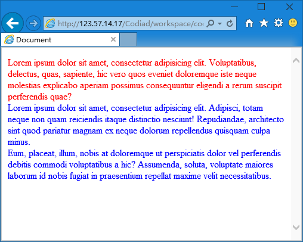

第十章 神一样的 CSS
===

神一样的 CSS ，本来网页世界是一片黑暗的，后来 CSS 给了他色彩。

css 叫做层叠样式表（英语：Cascading Style Sheets，简写CSS），这是我刚从维基百科上抄下来的（嘻嘻）。干他那么多呢，反正 CSS 就是主管样式的，什么是样式？除了内容就是样式。比如说：您好！这是内容，那么您好用什么字体，多大字号，显示在什么位置，什么颜色，什么背景色……这些就是样式。

这个神一样的对手（混熟了就是神一样的朋友）究竟能做什么我们需要随着学习慢慢去了解。这节课我们先说说要把 CSS 写在哪里。

**第一种：写在 Html 标签里**

	

	

这种很直接，优先级也最高，但是不简洁，想象我要是给一个元素设置十几个属性，然后整个页面的代码会乱成什么样子啊。而且也不能重用，下一个元素跟这个完全一样的样式，但是我还得复制一遍过去，而且将来修改了还要挨个去修改，简直更混乱了！

**第二种：写在 head 里**

	<!doctype html>
	<html lang="en">
	<head>
		<meta charset="UTF-8">
		<title>Document</title>
		
	</head>
	<body>
		……
	</body>
	</html>

上面代码中 style 标签中的部分便是。这种方法把 css 代码集中在一起便于查找和管理，只是页面文件会比较大，也有人说可能不利于 SEO （搜索引擎优化）。当然在我看来最大的麻烦是不方便我编辑。因为我要在下面的 html 代码里写网页结构，在上面的 css 里设置样式这样上面下面来回找一会就晕了。

**第三种：写在 css 文件里**

	<!doctype html>
	<html lang="en">
	<head>
		<meta charset="UTF-8">
		<title>Document</title>
		<link rel="stylesheet" type="text/css" href="style.css" />
	</head>
	<body>
		……
	</body>
	</html>

跟第二种方法比较，就是把 style 标签换掉，换作一个 link 标签去引用另外一个文件，然后我们把 css 代码写在被应用的文件（style.css）里，当然这个被引用的文件的名字和位置你是可以根据自己的需要随意设置的。

然后我们说说 css 选择器的基础内容。什么事选择器呢？就是你要给某个元素设置样式，那么是哪个元素呢？我们去描述是哪个元素这件事就是用选择器来描述。

	p { css 代码 }

这是针对标签的代码，p 就是一个选择器，他说的是 html 里的段落标签

	
这是一个段落

看到了，上面的 css 就会对下面的 html 结构产生作用。那么要是这里有很多个段落呢？那么既然都是 p 标签，便全部产生作用，咦，这个太好了！我想设置全部的段落文字样式也只写一次 css 就搞定了。

那么前面我们还讲了class 和 id ，说他们就是用来区分 html 元素的，那么他们的选择器怎么写呢？

	#topbox { css 代码 }
	.box { css 代码 }

对下面的 html 结构起作用

	

	

	

这样就很明白了，前边是井号（#）的就是说的 id ，前边是点（.）的就是说 class。

然后放一个完整的网页代码大家试试看。

	<!doctype html>
	<html lang="en">
		<head>
			<meta charset="UTF-8">
			<title>Document</title>
			
		</head>
		<body>
			
Lorem ipsum dolor sit amet, consectetur adipisicing elit. Voluptatibus, delectus, quas, sapiente, hic vero quos eveniet doloremque iste neque molestias explicabo aperiam possimus consequuntur eligendi a rerum suscipit perferendis quae?

			
Lorem ipsum dolor sit amet, consectetur adipisicing elit. Adipisci, totam neque non quam reiciendis itaque distinctio nesciunt! Repudiandae, architecto sint quod pariatur magnam ex neque dolorum repellendus quisquam culpa minus.

			
Eum, placeat, illum, nobis at doloremque ut perspiciatis dolor vel perferendis debitis commodi voluptatibus a hic? Assumenda, soluta, voluptate maiores laborum id nobis fugiat in praesentium repellat maxime velit necessitatibus.

		</body>
	</html>

效果如下

