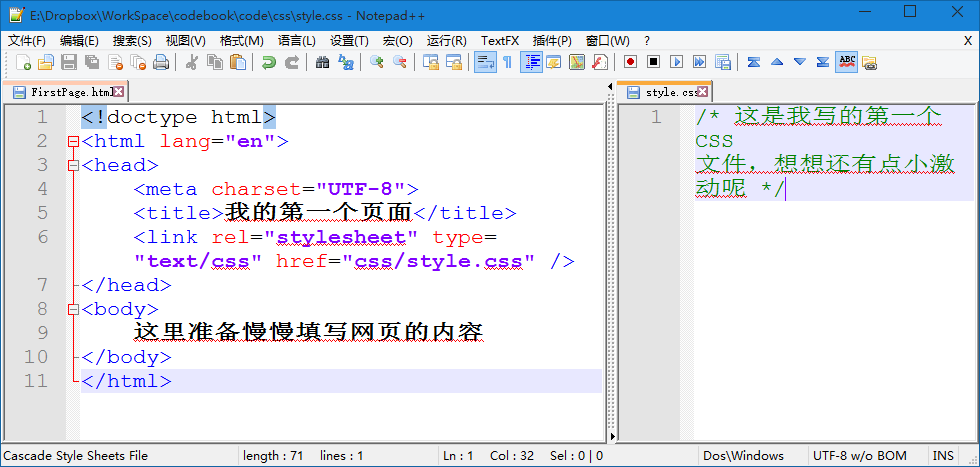

第十四章 让代码真的活起来
===

这个标题什么意思？是我们要赋予代码以生命。只是看懂了或者了解了那根本就不是学会了。听大师讲调色技巧把照片化腐朽为神奇您都听懂了，换张照片你能保证自己就能独立玩得转么？动手，动手才是硬道理。从这一章开始我们要一起动手写一个页面，希望大家不要光看着，要一起动手做起来。

我们要做的页面也很简单，大概就是那种最土的官网的样式，上面一条导航，下面一个通屏的大海报，然后下面并排三个格子，格子里写上一些内容，在下面是一个都是导航啊、联系我们啊、二维码啊之类的页尾。我不做示意图了，我想大家都明白的。反正我新装的系统也没装作图软件呢，就别难为我了。

我们先来规划一下文件结构：

	index.html
	images
		post.jpg
	css
		styles.css

初步规划就是酱紫，每个文件是做什么的大家一看就明白，也不多说，开始做起来。

新建 index.html 文件，在其中写上如下内容：

	<!doctype html>
	<html lang="en">
	<head>
		<meta charset="UTF-8">
		<title>我的第一个页面</title>
		<link rel="stylesheet" type="text/css" href="css/style.css" />
	</head>
	<body>
		这里准备慢慢填写网页的内容
	</body>
	</html>

然后在 css 文件夹里新建 style.css 文件，在里面写上

	/* 这是我写的第一个 CSS 文件，想想还有点小激动呢 */

就是下图这个样子：

你说怎么实现 Notepad++ 这样两个文件同时显示？你在一个已经打开的文件的标签上右键，然后移动到另一视图就可以了。

然后我们分析一下页面结构，大致可以分为四块：导航、海报、格子、页尾。我们一部分一部分去写。