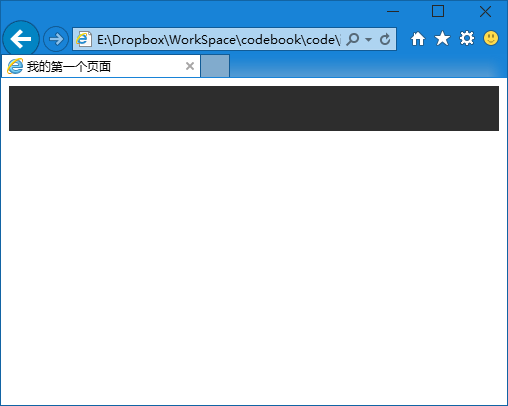
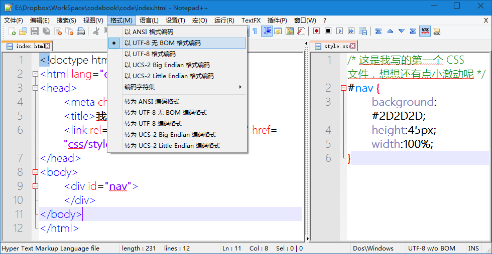
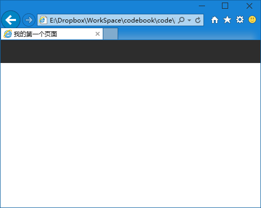

第十五章 导航（一）
===

导航部分其实有很多种写法，比如 html5 里有专门的 nav 标签。不过这次我们写的是一个老气的页面，所以我们也用一些常用的东西，这样你都别人代码的时候才不会太过震惊，这东西居然还这么用？

首先导航部分我们先把他总的给括起来

	

	

建立一个 id 为 nav 的 div ，用来包含所有导航部分。那么我们希望导航的背景色是接近黑色的灰，比如 #2D2D2D，

那么我们在 css 里写上

	#nav {
		background:#2D2D2D;
	}

当然，如果你这时候去看页面，会看到依然是空白一片的，为什么呢？因为这个div 里没有任何东西，然后他的大小是 0 * 0 ，自然也就没有任何显示了。

那么我们来规定一下它的大小吧，比如高度 45 px，那宽度呢？从左到右，我希望是通栏的啊，对吧，要不跟下面的通栏海报不搭配啊。那么宽度就是 100%。这个百分比是相对的，相对于他的上一级元素，那么 #nav 的上一级元素是谁呢？我们还没写别的，他的上级只可能是 body 标签了。

好，我们把 css 里填写上高度和宽度。

	#nav {
		background:#2D2D2D;
		height:45px;
		width:100%;
	}

预期中应该是这个样子的：

希望你也成功做到了这一步，如果你检查了每一个字幕，每一个标点都没发现问题，但是就是显示一片空白或者连标题都是乱码的话，你在 Notepad++ 菜单里找“格式”，把两个文件都设置为 utf-8 就好了，如下图：记得每个文件都要设置一下，这就好像作图的时候使用 RGB 色彩还是 CMYK 色彩一样的问题。

然后回过头来注意我们这个页面的效果，我们不禁要说：“我累个擦，怎么还有白边啊？”导航上边不是应该紧贴顶边的么？都设置宽度 100% 了，左右还没填满？

这个问题出在 body 身上，浏览器会给一些页面元素一些默认的属性，比如字体多大啊，什么字体啊什么什么的。这个是 body 默认有个外补（外补这个东西后面讲），那么我们需要消除这些默认属性对我们的影响，所以我们还要为此加上一些 css

	html, body {
		margin:0;
		padding:0;
	}

然后我们的代码变成了这样

我把它们放在了 #nav 的前面，当然其实他们的先后顺序并不重要，但是按照他们的层级去写还是有助于以后我们阅读代码和查询的，一般的全局的要写在最前面，上一层要写在下一层的前面。

好了，再看代码，选择器我写了 html, body ，其实这俩我单独写哪个你都能看明白，就是给某个标签的元素指定他的 css 样式。那么现在两个选择器中间用逗号（英文逗号）隔开呢？也没啥特殊的，就是给他两都设置如下的 css 属性。

margin 是外补，就是在元素外边补充空白，padding 是内补，就是在元素里边补充空白。这两个我们会在后面专门的去讲解，现在就先知道有这么个事情继续可以了。我把他俩都设置为零，于是就相当于没有他们什么事了，也就消除了影响。

零是个很特殊的东西啊，我说过在 css 里数值要写单位，但是 0 却可以不写单位，因为无论什么单位 ，0 都是等价的。别抬杠，我知道 0°C 和 0°F 和 0°K 不是一码事，但是我们写网页目前还用不到温度这样的属性。

看看效果

看看，多好，多黑！反正预期效果有了。下节课我们来给他添点内容