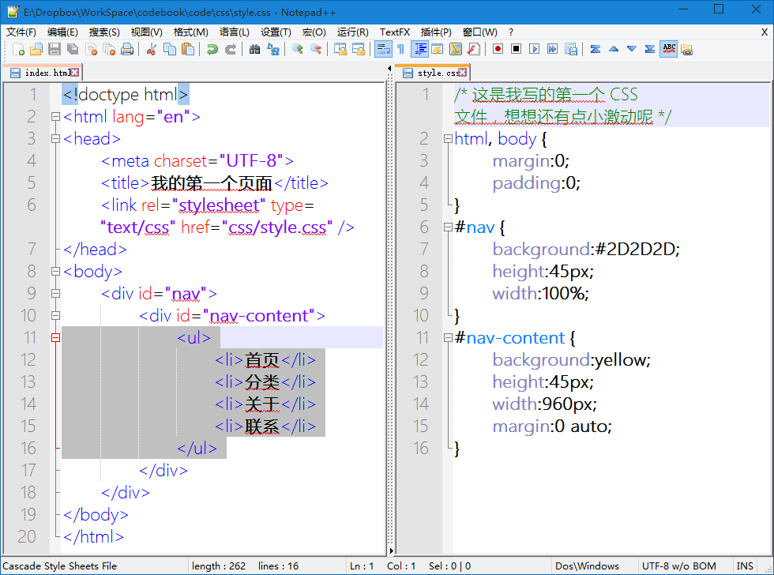
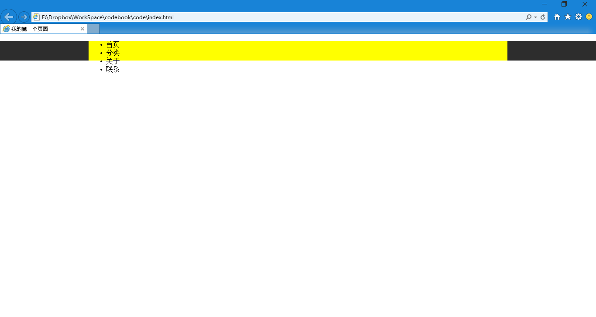
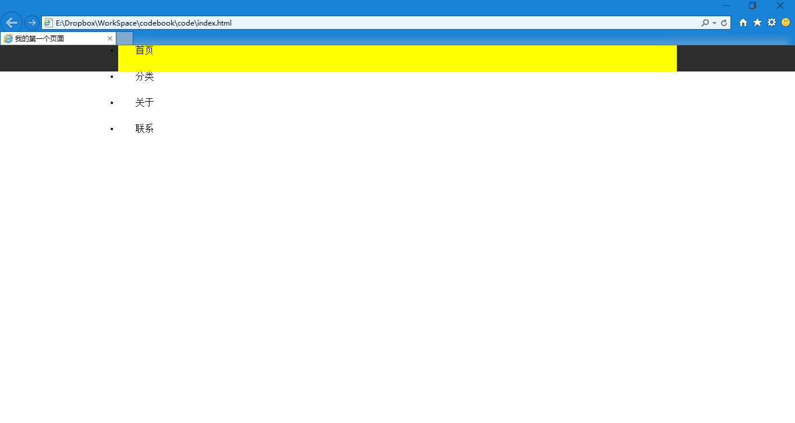
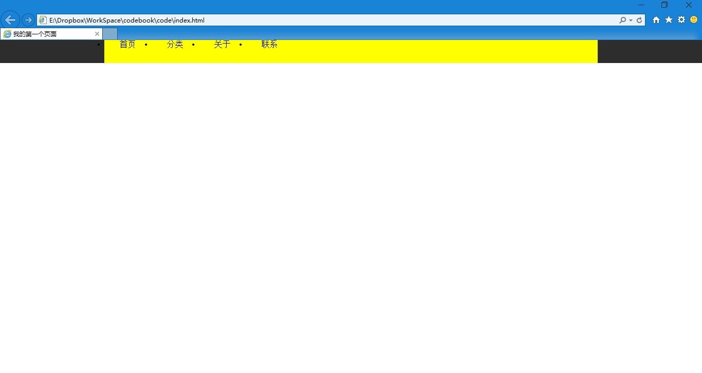
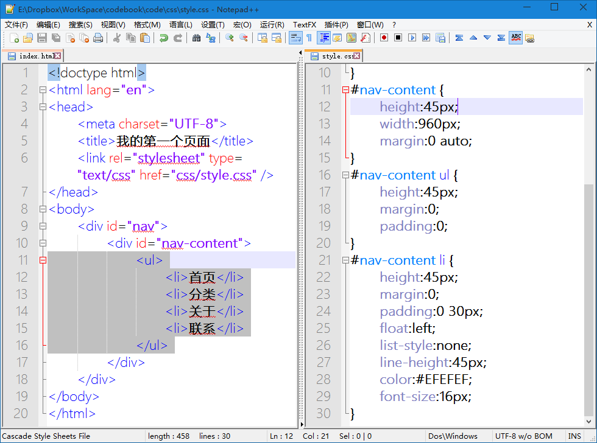
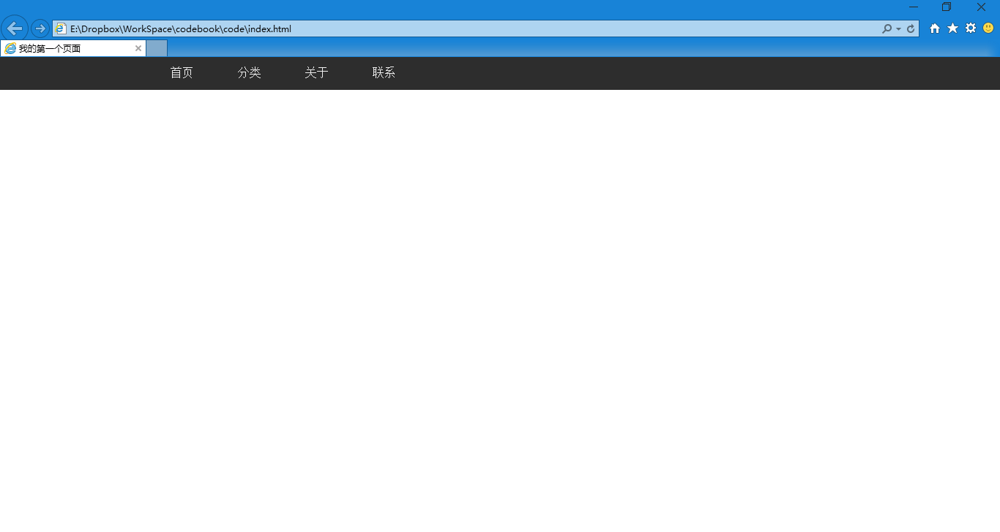

第十七章 导航（三）
===

终于，在两节课的准备工作之后我们要书写导航的内容了呢~嘿嘿嘿嘿，想想还真有点小激动呢~

这个导航啊，可以当做一个列表看（谁第一个这么想的？其实我真心想拍死他！），就像这样

> * 首页
> * 分类
> * 关于
> * 联系

反正都是一项一项的鱲角出来……我怎么还是觉得有点牵强。所以我们使用无序列表来表现。

	<ul>
		<li>首页</li>
		<li>分类</li>
		<li>关于</li>
		<li>联系</li>
	</ul>

然后我们把这段代码放在 #nav-content 里面试试看

打开页面……

天啊，坑死个爹了，谁说这像导航的？我保证我不打死你。可是，现在好多页面都用这个方法写的，所以我们还是坚持着往下走走好了。

现在我们要给上述代码规定一些样式来改善现在这种坑爹的状况。首先我们要写一个选择器，你说就写 ul 或者就写 li 就可以选择这两个标签了。可是你再想想，这样可是对整个页面的 ul 或者 li 标签起作用的。你希望除了导航以外的列表也发生变化么？当然不是，所以我们要缩小选取范围。

其实用语言表述的话，我们需要选择的是 #nav-content 里面的 ul 还有 #nav-content 里面的 li ，对吧？然后看我怎么表达这个意思。

	#nav-content ul {

	}
	#nav-content li {
		
	}

看到了，用一个空格分割两个选择器，就表示什么里面的什么。选择器可以一个很神奇很强大的东西，他很复杂，我们分在课程中一点点学习。好了，开始写 css，首先 ul 就是个框，高度跟外面的 #nab-content 一样就行，宽度先不管他了，什么外补内补全都不要，于是就是：

	#nav-content ul {
		height:45px;
		margin:0;
		padding:0;
	}

这个挺好理解的啊，那么 li 呢？高度 45 像素也没问题，宽度应该多少？你说多少都不合适，因为我现在导航里写的都是两个字看起来很整齐好像很好办，但是如果有五个字的导航项呢？“请点个赞吧”和“首页”用一样的宽度就混乱了，这时候我们需要的是什么？间隔，相互之间的间隔是一样的。你想到了外补和内补。那用外补还是内补？应该是内补，内补算是箱子里的东西，也就是箱子跟着变大，这样我们可以点击的面积比较大，用外补，你补的部分没法点击，那就只是视觉上的作用了。

	#nav-content li {
		height:45px;
		margin:0;
		padding:0 30px;
	}

这个可以看得懂吧，我们试试效果。

结果一看，继续坑爹，这时候我们想到一个关键的问题，这些导航项要横排啊，这么竖着怎么看怎么坑的。怎么横排？加一个 float:left;

	#nav-content li {
		height:45px;
		margin:0;
		padding:0 30px;
		float:left;
	}

浮动，方向是左，再看看效果

这次就知道了，一些元素想要横排，就让这些元素全都向左浮动就行了。然后我们继续看，这导航还有很多问题，第一个，前边的圆点是什么鬼？去掉！

	list-style:none;

列表的样式是什么？以前是圆点，现在不想要了，设置为没有。文字垂直居中啊，都在顶上要飞走么？

	line-height:45px;

因为导航只有一行，那么这行的高度跟外边元素的高度相同的话……基本就是居中了，多行文本这个方法肯定不行，不信你试试。都写上再看效果

好像有点像了哈，现在在解决一些小问题，那个黄色背景是我们为了可以看到 #nav-content 的位置而设置的，实际上一会我们要去掉那么黑色的文字在接近黑色的背景上就找不到了，给他个浅色吧

	color:#EFEFEF;

文字还要再大点，要设置一个字号，比如：

	font-size:16px;

就这些个你能看不懂？然后顺手去掉到 #nav-content 骚黄的背景。

再看看效果

好像差不多看得过去了，下节课我们再来加链接。