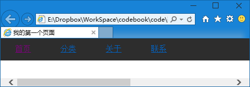
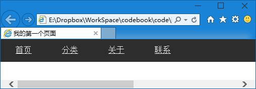
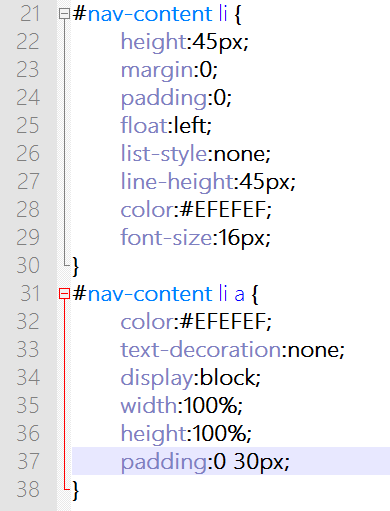

第十八章 导航（四）
===

加链接喽，不加链接的导航有毛用啊！

加链接很简单啊，大家一定都会的

	<ul>
		<li><a href="index.html" target="_blank">首页</a></li>
		<li><a href="cats.html" target="_blank">分类</a></li>
		<li><a href="about.html" target="_blank">关于</a></li>
		<li><a href="contact.html" target="_blank">联系</a></li>
	</ul>

这个都会吧？你问 target="_blank" 是什么？这个是在哪里打开，不写的话默认是在当前标签页打开，指定为 _blank 则是在新标签页中打开。

来来来，咱试试效果

当时我就哭了啊，我第一次觉得链接能这么难看！这都什么色（shair 三声）！改颜色！

	#nav-content li a {
		color:#EFEFEF;
	}

看到啦？三层的选择器，嗯嗯，这个一定要看懂啊。

好了，颜色终于回来了，我刚才被吓得都想躲起来了，下一个问题是下划线

	text-decoration:none;

对文字的装饰是啥？老子杀装饰都不想要啊！

然后效果就回来了，但是你移动鼠标看看，除了文字上剩下都点不了，就这么点的点击范围可不好，点击之前还要瞄准文字，老眼昏花的人可玩不了。

你肯定会说，我给 a 标签也设置上宽高！好的，我们试试看哦。

	#nav-content li a {
		color:#EFEFEF;
		text-decoration:none;
		width:100%;
		height:100%;
	}

我们说了，宽高的百分比是相对于外部元素的，也就是现在 a 的大小应该和外部的 li 是一样的。但是事实上文字外边还是点不了。这时候我们要引入一个新的属性 display

显示的效果是什么样的呢？常用的有 inline ，就是在行里面，比如 b 标签可以加粗文字，那么被加粗的这部分文字依旧按照文字原有的样式排版，比如该换行换行，都没问题。

但是如果是 div 呢，我们说了，div 是个盒子，盒子就是矩形的，所以不可能产生折行之类的效果。这时的 display 属性值是 block ，显示成块。

现在我们遇到的问题就是 a 默认为行内元素（inline），那他就跟文字一样的效果，所以你设置了宽高也没起什么作用，现在我们要让他作为一个块来显示。

	display:block;

然后你试了一下说不行，说我骗你。哼哼，其实明明有变化了，只是你没发现。添加 display 属性之前只有文字可以点击，现在文字上下都可以点击了呢！

那文字左右呢？是啊，左右呢？左右不是被 li 的内补（padding）占领了吗？都塞上泡沫了 a 自然就过不去了啊。

那，把泡沫去了？可这也不是我们想要的效果啊，算了，把泡沫塞到 a 里面试试看

然后去试试吧，我们成功了呢！