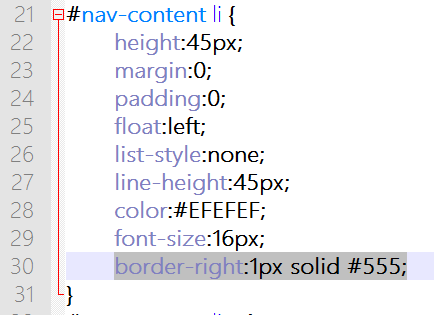
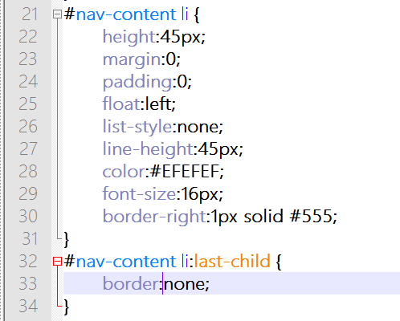

第十九章 导航（五）
===

功能实现了，但是美观和体验还差点。比如说我希望让导航项之间有个分割线，这样用户就知道鼠标大概点在哪个范围内比较准确了。

这个用边框就可以实现，不过边框这东东比内部外部还要复杂。他不光有四个方向，还有边框样式和边框颜色。

	border-width
	border-style
	border-color

我这么一写你就看明白他们什么意思了，他们还可以带上方向，比如

	border-top-width
	border-left-style
	border-right-color

这么说来设置一个元素的边框果然是个大工程。所以我们还是浓缩一点写吧。

	border-right:1px solid #555;

右侧边框一像素宽，实线，颜色 #555。#555 就等价于 #555555 ，这样写短一点。现在我们把这条属性加给 li 元素。

然后效果如下，边框的颜色不很明显仔细看 。

真好，中间就割开了，但是有木有觉得最后还多一条啊！其实最后一个 li 根本就不用有边框就可以的。这个事情描述如下：所有的 li 右侧都是 1px 的边框，但是最后一个 li 没有边框。前半句上边已经实现出来了，现在再告诉一下最后一个不要边框就对了。

最后一个，这个选择器怎么写？

	#nav-content li

这是我们前面选择 li 的选择器，

	#nav-content li:last-child

这是选择最后一个 li 的选择器，就是他们中间最后一个孩子，好理解吧，那要是第一个 li 呢？

	#nav-content li:first-child

So easy！就是这么好玩~可惜的是 last-child 在 IE 6—8 中好像不被支持。让我们默默的为笨笨的 IE 竖起中指。

好了干正事

	#nav-content li:last-child {
		border:none;
	}

不过要记得啊，这段代码要放在 #nav-content li 那段之后，就像酱紫

为什么呢？当 css 冲突的时候，以后面的为准。 #nav-content li 中的设置对最后一个 li 起不起作用？当然起作用，所以最后才多了一条竖线，然后我们才要消除这条竖线。就好像先是我们一人一个苹果，然后在从你手中拿走苹果，好了，我有苹果你没有的效果达到了。反过来说的话就是，你手里没有苹果，然后跟咱们一人一个苹果，结果大家都有苹果，效果就没达到。

虽然真心说不上怎么好看，但是我们简陋的页面中简陋的导航算是有了，你要是有兴趣可以试着用现有的知识去美化它一下，一切都是可能的，只要用心尝试就可能达到目的。

下一节我们开始搞定页面中的大海报。