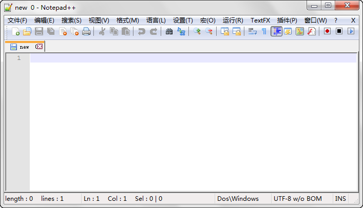
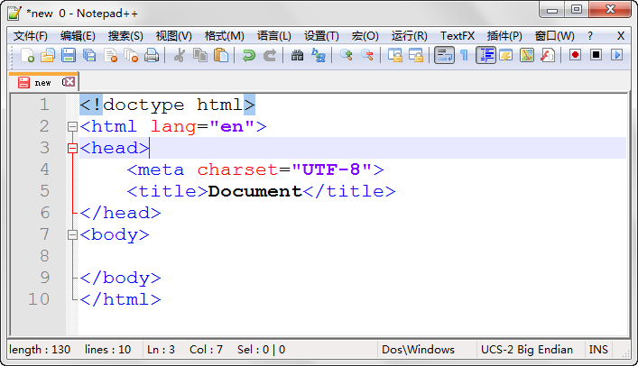

第二章 网页的基本结构
===

现在打开 Notepad++ ，它会自动新建一个空白文件 “new 0” ，如下图：

!(图2-1)[images/2-1.png]第二章 网页的基本结构
===

现在打开 Notepad++ ，它会自动新建一个空白文件 “new 0” ，如下图：

这时候就如同我们在 Photoshop 里新建了画布。然后心怀激动的开始我们的有可能是分为带的作品吧！

复制如下代码到这个新文档中。

	<!doctype html>
	<html lang="en">
	<head>
		<meta charset="UTF-8">
		<title>Document</title>
	</head>
	<body>
		
	</body>
	</html>

于是我们得到了：

咦？！怎么五颜六色的？——这个功能叫做“代码高亮”，意思就是用不同的颜色来标记不同功能的代码。打个比方说：我们写了一篇文章，但是想要一眼在其中找到谁在干什么其实并不容易，但是如果文章中所有的人名都用红色标注，所有的动词都用蓝色标注，那么我们检索的速度必然会大大增加。这里也是相同的道理，不同颜色的标注可以使得我们快速定位代码中的关键词。

当然这么说挺复杂的，那么不管他，继续就是了。看的时间长了，自然而然的就感受出他的便捷来了。