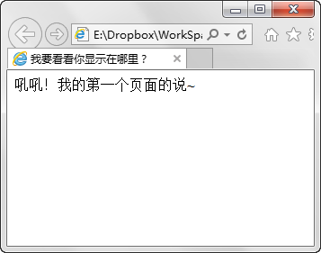

第二章 网页的基本结构
===

现在打开 Notepad++ ，它会自动新建一个空白文件 “new 0” ，如下图：

这时候就如同我们在 Photoshop 里新建了画布。然后心怀激动的开始我们的有可能十分伟大的作品吧！

复制如下代码到这个新文档中。

	<!doctype html>
	<html lang="en">
	<head>
		<meta charset="UTF-8">
		<title>Document</title>
	</head>
	<body>
		
	</body>
	</html>

于是我们得到了：

咦？！怎么五颜六色的？——这个功能叫做“代码高亮”，意思就是用不同的颜色来标记不同功能的代码。打个比方说：我们写了一篇文章，但是想要一眼在其中找到谁在干什么其实并不容易，但是如果文章中所有的人名都用红色标注，所有的动词都用蓝色标注，那么我们检索的速度必然会大大增加。这里也是相同的道理，不同颜色的标注可以使得我们快速定位代码中的关键词。

当然这么说挺复杂的，那么不管他，继续就是了。看的时间长了，自然而然的就感受出他的便捷来了。

现在我们再来看看这段代码，其实这只是一个最基础的 Html5 的网页结构。那么现在我来给它添加一些注释。

	<!doctype html>	<!-- 这行代码说明文档类型 -->
	<html lang="en">	<!-- <html>是标记 html 文档的开始，lang="en" 说明网页的语言是英文 -->
	<head>	<!-- <head>是标记网页头部信息的开始，这里主要放一些网页本身需要用到的信息 -->
		<meta charset="UTF-8">	<!-- 这里说的是网页的编码是 UTF-8 -->
		<title>Document</title>	<!-- 这里是网页的标题 -->
	</head>	<!-- </head>是标记网页头部信息的结束 -->
	<body>	<!-- <body>标记网页的主体内容（页面内容）的开始 -->
		
	</body	><!-- </body>标记网页的主体内容（页面内容）的结束 -->
	</html	><!-- <html>是标记 html 文档的结束 -->

看着都想睡觉了，是不是？我也是啊，好了，记得注释的格式就好。

	<!-- 这个格式里面的内容是注释，不会起任何作用，但是可以用来标注一些内容留给自己看 -->

至于上面的那些内容，其实写页面之前先复制过去就好了，就好像刚开始学 Photoshop 的时候新建一个文档要设置什么颜色模式啊，分辨率啊……我们也是看不懂，所以索性不看，慢慢的也就明白了。嗯，我们来做点实际的事情吧！把代码稍微修改一下

	<!doctype html>
	<html lang="en">
	<head>
		<meta charset="UTF-8">
		<title>我要看看你显示在哪里？</title>
	</head>
	<body>
		吼吼！我的第一个页面的说~
	</body>
	</html>

我就修改了两个地方，就是那两个汉字的地方，然后我们把这个文件保存为 Html 文档，比如叫做 FirstPage.html 好了，嗯，一定要保存在你找得到的地方哦，比如桌面就是个不错的地方。

然后我们双击打开这个文件（如果双击后不是打开了浏览器，那么就直接把文件拖到浏览器里好了，嗯，我们就是这么直接！）

好了，现在看到标题和页面内容应该分别写在哪里了吧？