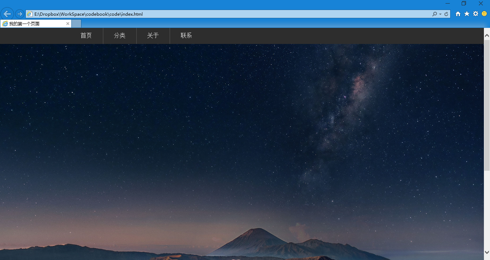
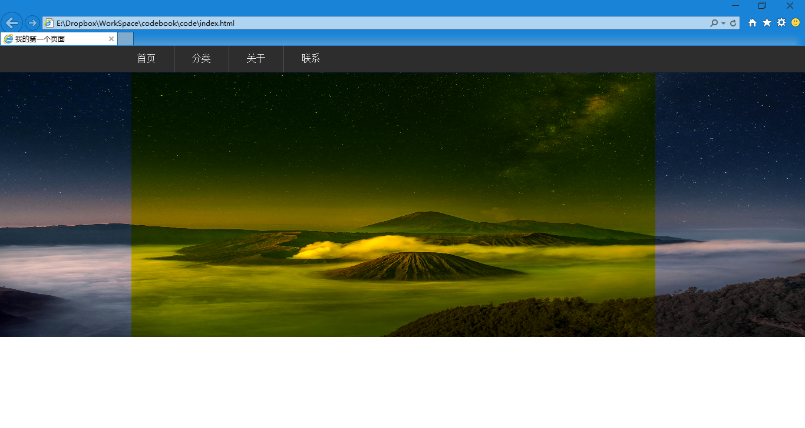
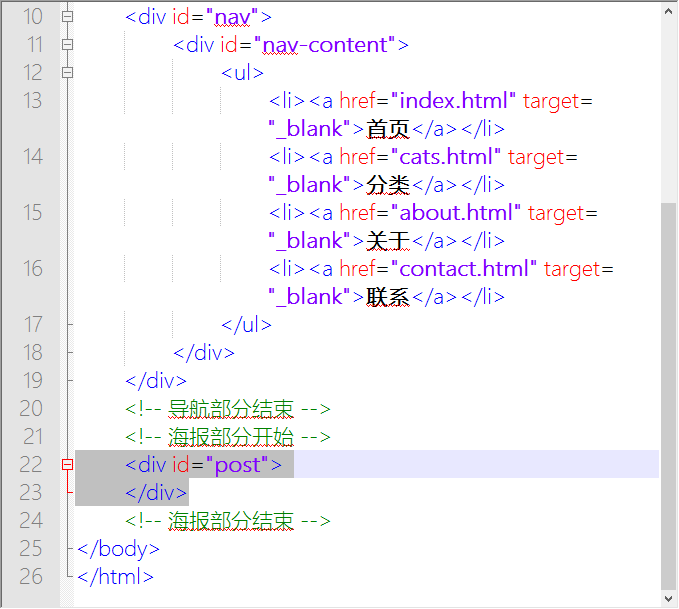
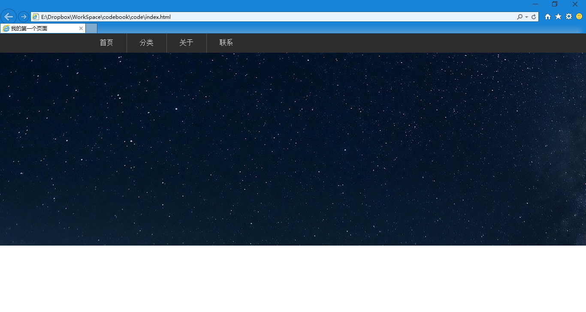
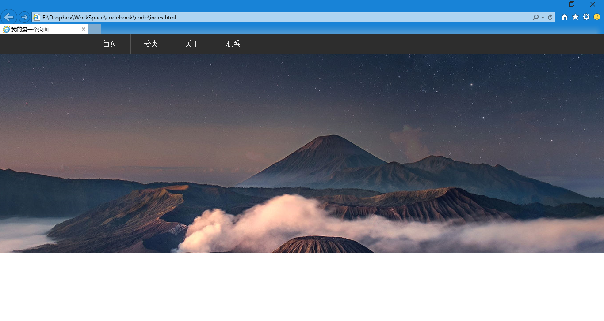
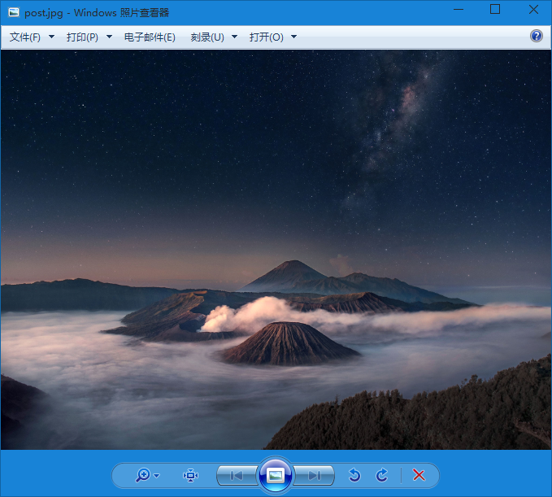

第二十章 海报（一）
===

你说什么？这节不用讲了？大海报就是一个 img 标签嘛，然后设置宽度 100% 就行了。那咱们试试好了。

	

是这个意思吧，对了，海报图片是我在 500px 上顺的，咱就演示效果，别在意那些细节噢

高度太大了，再给个高度，比如 450px 怎么样？

	

变形了，额，那我用 PS 把图片裁剪一下。可是读者的浏览器窗口大小可是都不一样大的呀，这怎么弄？好像是个难题。

还有一个问题你没考虑到，我们假设要给这个大海报加链接的话，你打算怎么加？整张都加链接？那样很容易误点击的。看一个网页的时候不小心点错了链接，会让读者心情不好的。

正确的方法是只在中间部分加链接，就如下图中黄色区域.也就是我们说的那960 像素宽的主体内容区域，在这以外的只是装饰。其实我们设计网页的时候也都会先把这个区域确定出来，内容不要超出这个区域。

这时候我们就要换一种方法了。来先写一个 div

	

	

这时候看看我们的代码，你注意我写的注释，适当的添加注释可以让自己更容易看懂自己写的东西。

然后我们去写 css 啦，再说一遍啊，html 就是框架和内容，样式全都扔给 css。这样两个文件看起来都很清楚啊。

	#post {
		width:100%;
		height:450px;
	}

这部分没有疑问吧，然后给这个 div 设置一个背景。

	background:url(../images/post.jpg);

变成了这样

貌似看得过去，但是那些山呢？怎么只看到星空？这个，其实背景的设置默认是左上角对齐的，那么我们的图比较大，所以只能显示出左上角的一部分了。这时候我们要设置背景图片的偏移。

	background-position:x y;

x，y 是偏移的坐标，x 轴是从左上角往右是正方向，往左是反方向。y 中从左上角往下是正方向，往上是反方向。不用刻意记，试试就知道的东西。

然后有几个特殊值，x 轴 left center right；y 轴 top center bottom；就是讲这个元素和他的背景是左边对齐右边对其上边对齐，下边对齐还是中心线对齐。

我们现在希望横向中心线对齐，就是背景的中心线和页面的中心线重合，所以 x 轴是 center。上下方向，我希望图片下边的山也显示出来，那么图片应该相对现在的位置向上移动一些。向上是负方向，那么值是负的。至于是多少大概估摸一个 -600px 试试看，然后再根据实际显示效果修改就对了。

	background-position:center -600px;

然后看一下我用的这张背景图片

居中对齐没有问题了吧，唯一的问题就是图片偏上了，怎么往下移动？修改 background-position 中 y 轴的值。那是改大还是改小？

y 轴向上是负方向，向下是正方向，我们向下移动，就是改大，所以改成 -450px ，想明白哦，这是负数值，所以 -450px 可比 -600px 大。其实吧，你改错了一看效果就知道，下次往反方向修改就是了，根本不应去记。 USB 插口朝哪边你去记么？一次插不对就反过来就是了。