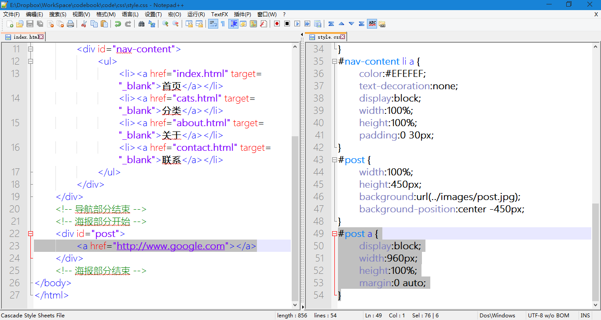
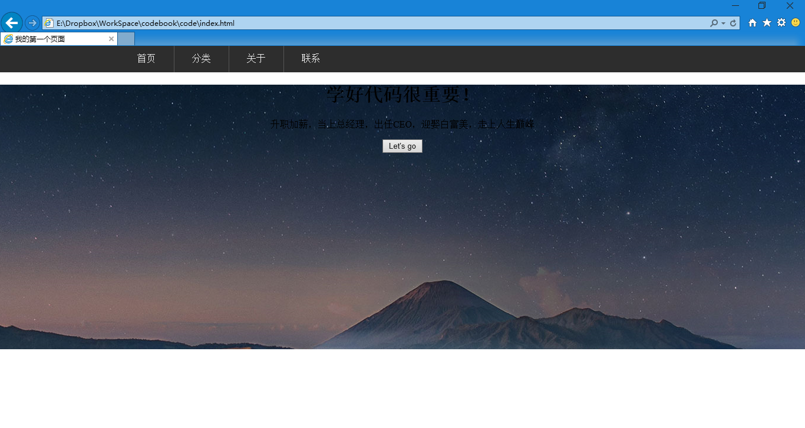
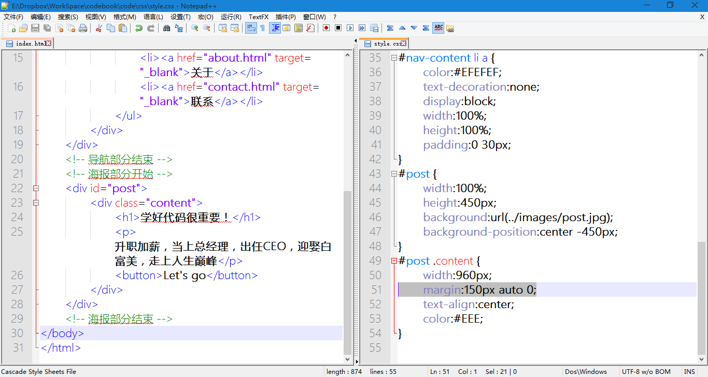
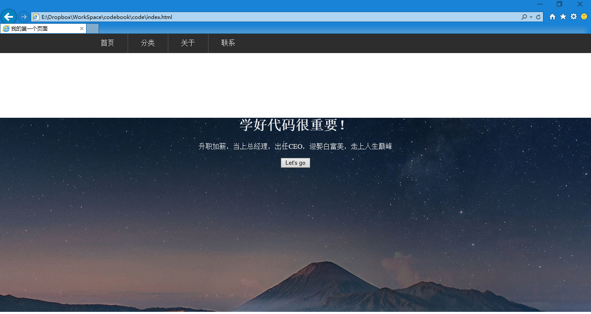
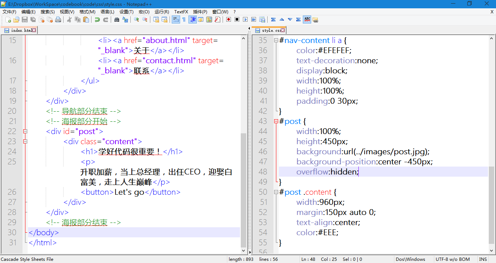
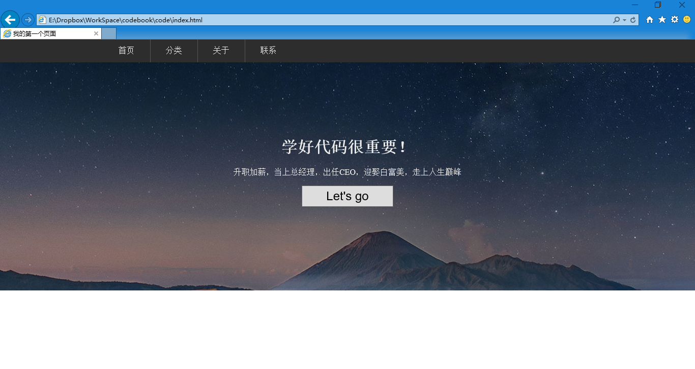
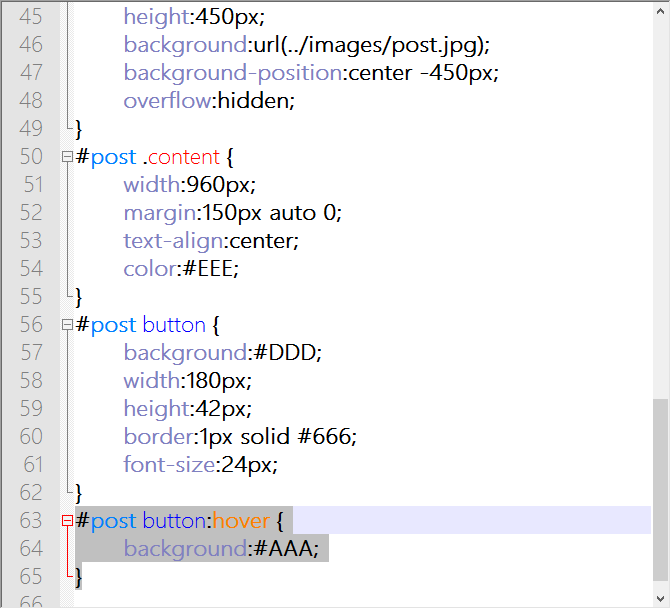
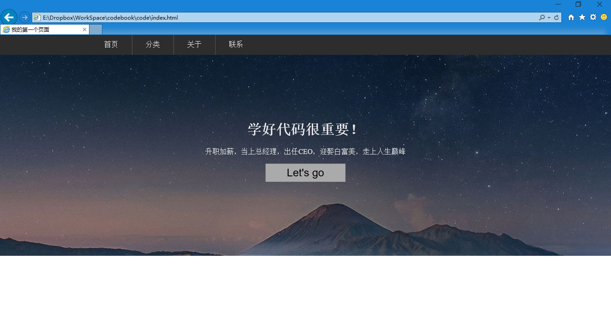

第二十一章 海报（二）
===

好了，现在有了背景，我们来想一想内容的事情。这个事情好像很简单地说。假设我们现在背景大海报内容很完备，我们现在需要的只是加个链接。那么就是加个 a 标签的事

	

然后定义一下样式，既然我们打算设置它的大小，那么 display:block 属性肯定不能少了。宽度 960px，高度 450px 或者 100%，然后要让他居中，所以加一个 margin:0 auto 应该就对了，我们写下来试试看

	#post a {
		display:block;
		width:960px;
		height:100%;
		margin:0 auto;
	}

显示效果不截图了，没有变化，但是中间部分有链接可点击的效果达到了。

不过好可惜，我们的海报上是空白的，总是要添加一些东西才好。所以我们修改 链接部分为：

	

	

css 自然可以去掉 display:block 属性，因为 div 本身就是 block 属性的元素。然后考虑到内容的排版，我们加一个文字居中的选项。text-align:center ，center 换成 left 或者 right 则分别是文字左对齐和右对齐。于是 css 改作如下：

	#post .content {
		width:960px;
		height:100%;
		margin:0 auto;
		text-align:center;
	}

现在预览的话自然没什么变化。我们继续添加内容

	

		<h1>学好代码很重要！</h1>
		
升职加薪，当上总经理，出任CEO，迎娶白富美，走上人生巅峰

		<button>Let's go</button>
	

看一眼就气哭了，这跟我想的不一样啊！

别的不说，先加个 color:#EEE; 让我看清文字再说。当然这对现在混乱的布局没起到什么作用。那条白边是怎么回事我搞不懂，先不去想它，但是我搞懂了我的文字太靠上了。怎么让文字往下挪一挪？这是一个问题。然后我想想 .content 的 div 既然不是用来点击的了，那它的高度是不是 100% 好像也没啥关系，拿给他去掉高度吧，然后在他的顶上加一个 150px 的外补试试看。

然后我就改成了这个样子

看效果，看效果！

泪眼朦胧的我哭昏在了桌子上。刚才还一小条的空白现在怎么还成长了啊！我本不想理你，你却变本加厉！

我想想啊，我就把顶部的 margin 修改了一下。结果上面的空白就大了。这好像是 #post 里面的内容跑出去了的样子。那我就在找一个新属性，加在 #post 上，让他里边的内容如果抛出去了就把跑出去的部分隐藏掉，哼哼，我不要的就不要看到！！！

	overflow:hidden;

这意思就是溢出了就隐藏啊。看看现在 代码变成这样。

然后再心怀忐忑的去看效果

终于有点样子了！那个标题（h1），和文字部分的字体（font-family），字号（font-size）之类大家自己设置。我就不演示了。现在比较受不鸟的是那个按钮也太小气了吧！那就给他写个样式看看：

	#post button {
		background:#DDD;
		width:180px;
		height:42px;
		border:1px solid #666;
		font-size:24px;
	}

然后看看效果，

嘿，这次差不多了，但是好像还有点什么问题，对了，鼠标滑倒按钮上怎么没变化了？看着好死板。

好，我们再来个有意思的选择器，#post button 这个元素的鼠标滑过状态写作 #post button:hover ，来让我们试试。

	#post button:hover {
		background:#AAA;
	}

咦，这个怎么定义的这么少？因为未定义的属性则遵循这个元素原有的属性，即未尽事宜，参照旧例。所以没有发生变化的东西就不用再去定义了，我们把他加上试试看哦。

注意哦，我把这条内容放在了 #post button 的样式之后。发生变化嘛，总要有个基础去参照的，参照标准在前很正常，从什么变到了什么。但是反过来说就混乱了。

这次鼠标滑过按钮，按钮的背景色就会变深。然后留个思考题，怎么点击按钮就可以跳转到别的页面呢？