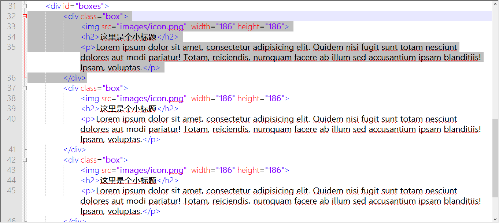
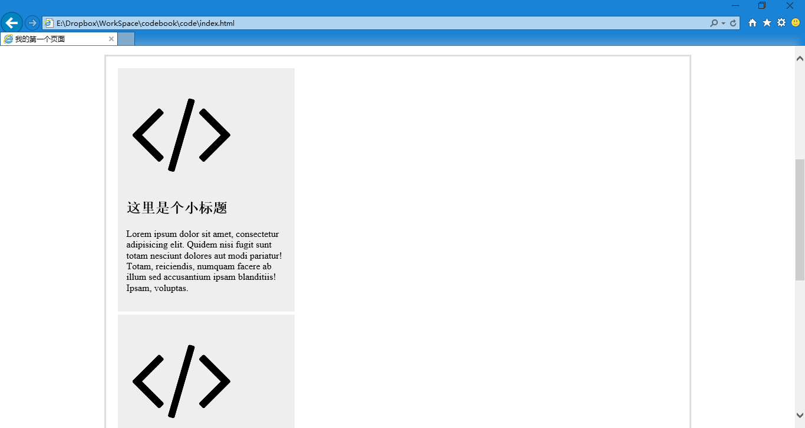
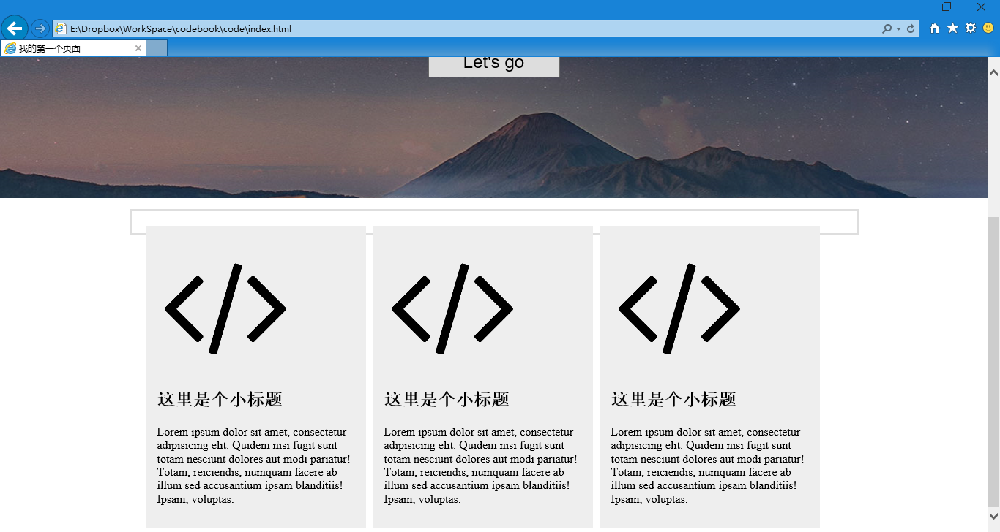
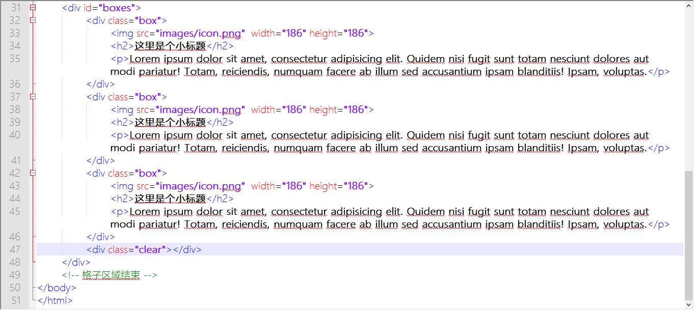
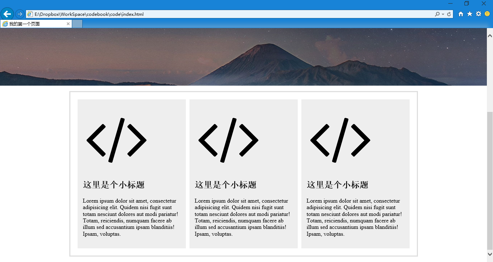
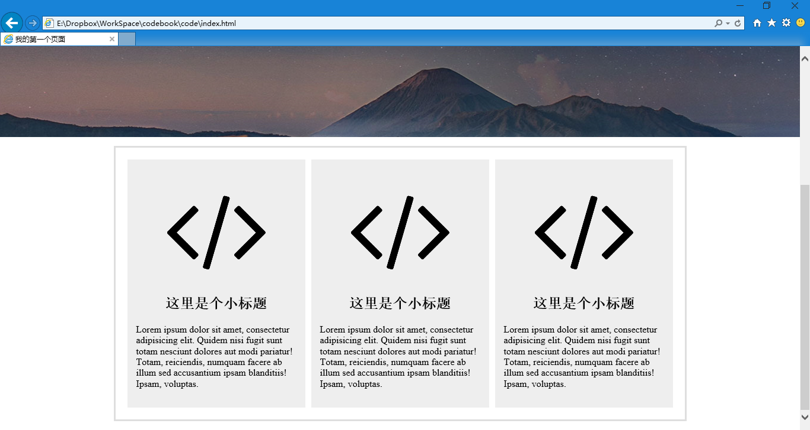

第二十二章 格子
===

其实我也不知道这个区域该叫什么名字，所以个字这个称呼多少有些词不达意。但是这并不会影响我们实现效果。

根据前面的经验，我们现在需要一个容器，来放置这三个格子。这也很容易，一个 960 宽的 div ，然后居中显示（margin:0 auto），就行了，用过两次了，这次应该轻车熟路了。

	

	

css 如下：

	#boxes {
		width:960px;
		margin:0 auto;
		border:3px solid #DEDEDE;
	}

为啥没写高度？这部分区域的高度是变化的呀，里面格子中的内容多了就高，否则就矮。所以先不写了。然后看看效果。

可得仔细看哦，海报下边的灰线就是了，因为没有高度嘛，上下边框贴在一起，就成了一根线。不过我们还是能从中看到问题，跟海报贴在一起了，可是我们希望他黑海报之间有些空隙的，比如 15 像素，所以我们改一下 margin

	margin:15px auto;

因为后面我们也会希望页尾跟他间隔 15 像素的，所以干脆上下的外补都加上好了。同时我们想，这个边框跟里面的格子要不要有间隔？当然也是有的好，否则边框和里面的盒子贴着也没什么用了，那好，内补也加 15 像素。当然了，内补肯定是全方位的，所以

	padding:15px;

这次我们再看一看效果。

有那么点意思了哈，准备添加格子。每个格子的结构都是一样的

	

		
		<h2>这里是个小标题</h2>
		
Lorem ipsum dolor sit amet, consectetur adipisicing elit. Quidem nisi fugit sunt totam nesciunt dolores aut modi pariatur! Totam, reiciendis, numquam facere ab illum sed accusantium ipsam blanditiis! Ipsam, voluptas.

	

但是先别着急写，咱们先算算帐，这很重要，总宽度 960px，刨除左右内补各 15px ，剩下 930px，我们打算搞三个格子，平局每个格子 310px 宽，那里面的图标图片就不能很大，假设我们按照黄金分割计算的话（原谅我在装 X ），大概是 186px 宽，然后图标是正方形，所以我先给他把这个限制加上好了，否则一预览我立刻就哭。图片肯定把结构撑破了，我的图标选的有点大（512*512）

然后变成

看到啦，我又复制了两遍，就是酱紫了。现在我们来给 .box 写 css

	.box {
		width:270px;
		margin:5px;
		padding:15px;
		background:#EEE;
	}

来计算一下哈， 270 +（5 * 2）+（15 * 2）= 310 ，这个数值就合上了，嗯，对，内补（padding）的值不计算在宽度和高度之内。外补我们也没算在狂傲之内啊，所以一视同仁了。来看看效果。

好像想起什么来了，横排，这些个字要横拍，怎么写来着？

	float:left;

赶紧加上试一试

然后我们发现两个大问题：第一、边框没圈上这些格子；第二边框右侧比左侧多出了一截。

我们先说第二个问题，为什么多出来一截呢？就是说边框比我们的格子宽，可是刚才我们掰着手指头计算过的呀？一定是哪里搞错了。那么注意着一个问题：**内补（padding）的值不计算在宽度和高度之内**，但是前边我们给 #boxes 加内补的时候可没有改宽度，那么实际上现在 #boxes 的宽度是 960+ 15 * 2 = 990 ，你说能不多出一截吗？所以我们把 #boxes 的宽度减掉 左右内补的宽度就行了，也就是改成 930px。

相对的，边框没把格子圈进去这个就略微麻烦一些了。我们想一下，个字我们浮动（float）了，但是外面的边框（#boxes）我们浮动了吗？当然没有，所以在这里我们要提到一个新的问题——清除浮动。当你的浮动用完了要清除一下的说。这个问题有好多种解决方法，有兴趣的可以去查一查“css 清除浮动”。在这里我就讲一种最常见的。

我们在所有浮动之后再添加一个空的 div

	

然后设置他的 css 为

	.clear {
		clear:both;
	}

自信看看我把它放在了什么位置哦，可别搞错了

然后再来看看效果

然后就是图标和标题的居中

	.box img {
		margin:10px auto;
	}

这是在图标居中的同时我还希望他上下多一些空隙。

	.box h2 {
		text-align:center;
	}

然后我们发现标题如愿以偿的居中了，但是图片没动，为啥昵？因为图片是内联（display:inline;）元素，所以我们得给他设置一个 

	display:block;

然后看看效果

终于如愿以偿了呢~~