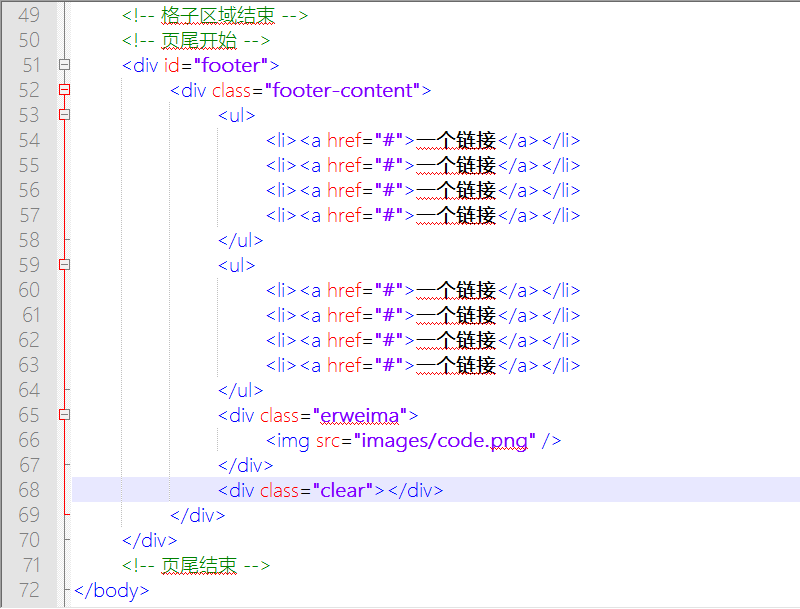
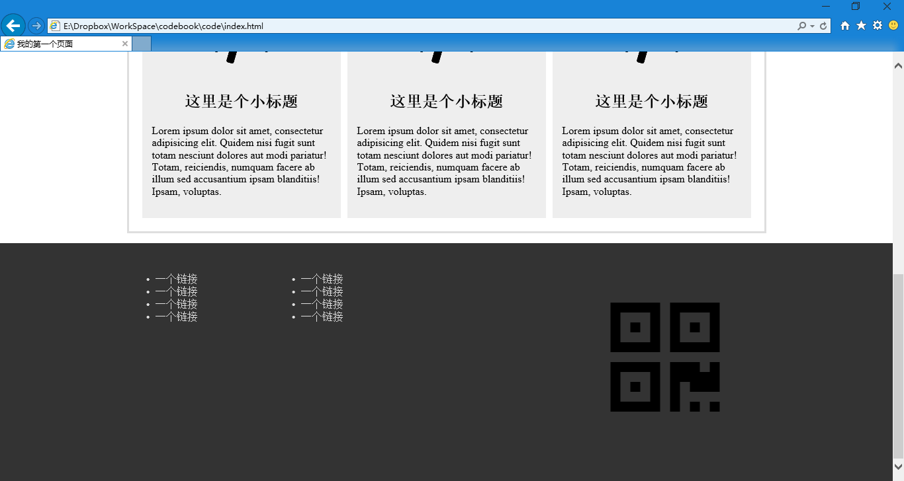
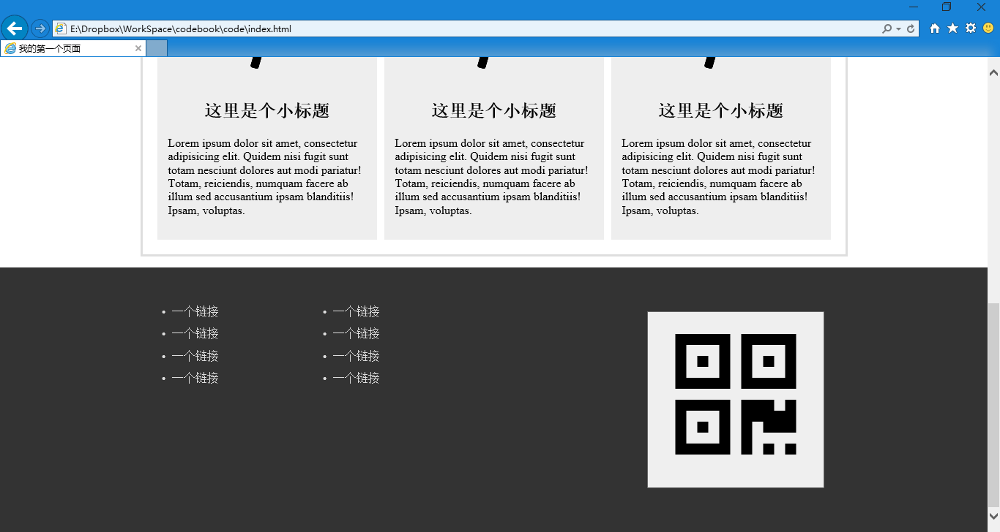

第二十三章 尾部
===

这一章是练习章节，因为基本都是使用前面学过的东西。

先来个大背景，嗯，通栏滴，怎么写来着？

	

	

然后 css 是

	#footer {
		width:100%;
		padding:30px 0;
		background:#333;
	}

想一想都是为什么？然后我们在 #footer 中添加i一个内容区域。

	

	

css 的内容也跟以前的写法一样

	#footer .footer-content {
		width:960px;
		margin:0 auto;
	}

这也蛮好理解的。下面我打算放两列（不是凉行）链接在左侧，然后在右侧放个二维码。所以网页结构如下

	

		<ul>
			<li><a href="#">一个链接</a></li>
			<li><a href="#">一个链接</a></li>
			<li><a href="#">一个链接</a></li>
			<li><a href="#">一个链接</a></li>
		</ul>
		<ul>
			<li><a href="#">一个链接</a></li>
			<li><a href="#">一个链接</a></li>
			<li><a href="#">一个链接</a></li>
			<li><a href="#">一个链接</a></li>
		</ul>
		

			
		

		

	

这些代码应该也不需要什么解释了，当然，因为我知道一会我要使用浮动（float）来进行横排，所以我就先加上了 .clear 的元素进行清除。

现在写 css

	#footer ul {
		width:180px;
		float:left;
	}
	#footer a {
		color:#DDD;
		text-decoration:none;
	}
	#footer .erweima {
		width:300px;
		float:right;
	}
	#footer .erweima img {
		display:block;
		width:240px;
		margin:30px auto;
	}

应该都看得懂吧，这些前面都是讲过的，至于二维码那里图片为什么和外面的 div 之间留了空隙，我们一会再讲。先来看看效果

发现问题了么？嗯那些链接之间的距离太小了，所以加一个

	#footer li {
		line-height:24px;
	}

然后就听见有人一声断喝：“你丫二啊，那二维码跟背景都顺色（shair三声）了，你看不见啊？”我看到啦，但是我得一个个来啊，不就是加个白背景么？

	#footer .erweima img {
		display:block;
		background:#EFEFEF;
		width:240px;
		margin:30px auto;
		border:1px solid #666;
	}

看得出来我加了哪两行吧？当然，我这张图片特殊，四周本身就有透明的空白，否则我还需要用内补（padding）来增加周围的空白，给图片直接加背景，这玩法大家会了么？

好吧，虽然不好看，但是我们就假装达到预期了哦。现在我们来加点不一样的东东

	#footer .erweima img:hover {
		width:300px;
		margin:0 auto;
	}

看得出来，我修改的是二维码图片的划过效果，我们看他发生了什么变化？宽度改变了（如果没写高度那么高度就是自动，也就根据宽度等比例变化），然后因为宽度变化，外补（margin）也做了相应的变化。这样保证了图片的中心位置没有发生变化。

刷新一下试试吧，现在鼠标滑到二维码上，图片会放大哦~

就这么糊里糊涂的，我们写了一个丑陋的页面。当然我们借此学会了很多常用的东东。知识点并不是很多，现在回顾起来也不过那么几个。如果你学会了，也练习着写个不一样的页面吧，写好后记得截图发上来，看看大家谁做的页面最漂亮哦~这个是作业哦，记得认真完成。

后面我们要讲点周边知识了。