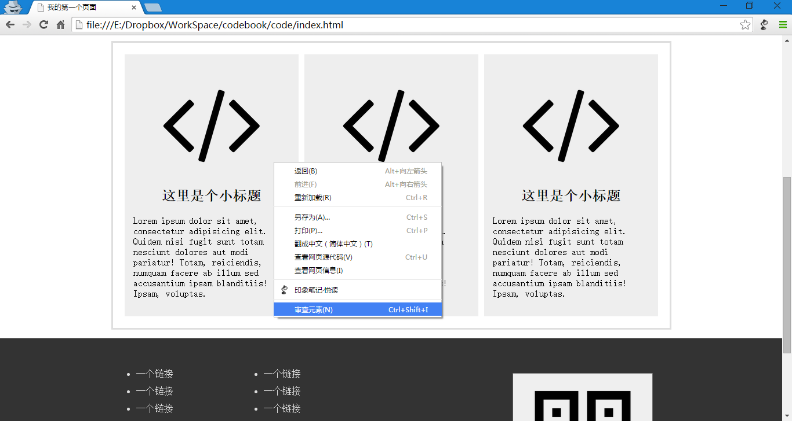
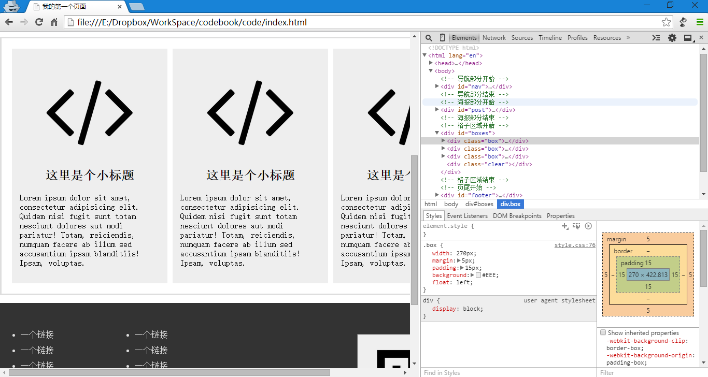
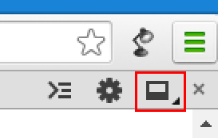
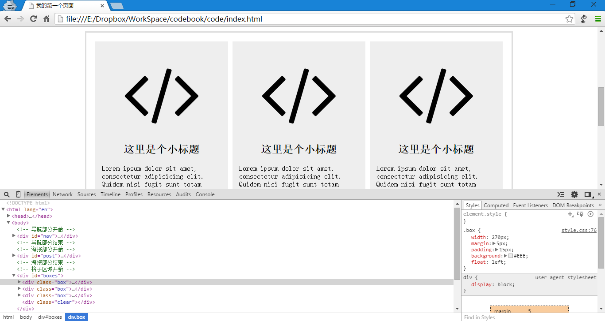
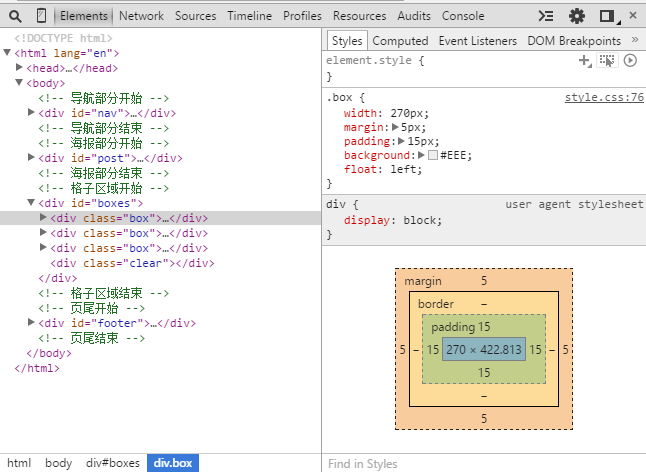
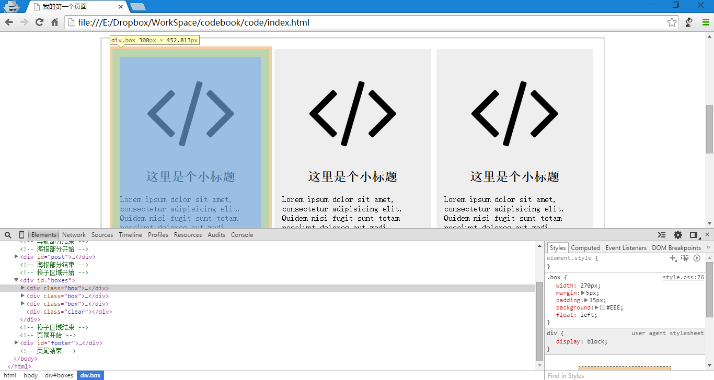
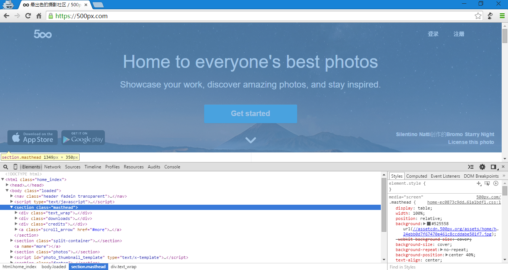
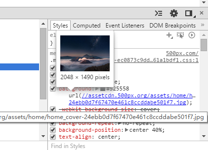
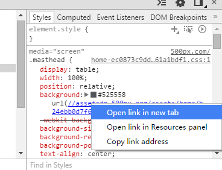
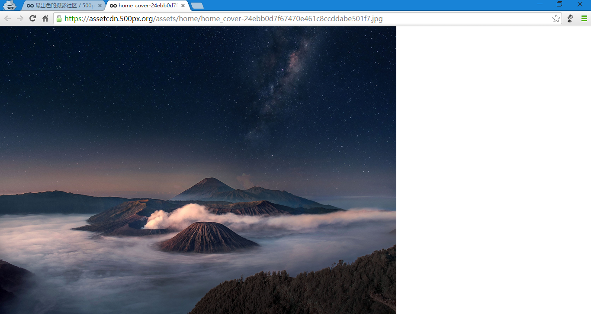

第二十四章 审核元素
===

这是一个很美妙的技巧哦，用来学代码，查错误都是极好极好的。当然我现在说的浏览器是 Chrome。其他浏览器也都有类似功能，IE ……额，好像是从 IE8 开始也有了吧，反正现在 IE11 的我用着还是经常不正常，反正微软也要抛弃 IE 了，谁用他啊！

开始正题，现在以 Chrome 举例，其他浏览器大同小异，我也用 Firefox ，所以 Chrome 党和 Firefox 党都不许拍我！

用 Chrome 打开我们写的页面，不知道怎么打开的就先打开 Chrome，然后在我们写的 html 文件拖进去。然后在任意位置（确切的说是你想要检查的元素上）右键。

然后选择“审核元素”，PENG 的一下，就变成了这样

别紧张，其实我也看不懂。然后注意右上角的按钮

点那个红框里的，别在浏览器里找红框，这红框是我画的，然后 PENG 的一下，又变了。

你看，这东西可以放在下面，也可以放在右面，然后你怎么方便怎么用就是了。然后我们来研究下这里面的内容。

左侧是当前网页显示内容的代码（这个代码是可以发生变化的，与网页源代码不同，后面我们就会明白了。现在记住当前就可以）。右上是左面代码中选中元素的样式（css）。右下那个方块是当前元素的盒模型。我们不是说 div 像个盒子吗？这里就用模型吧他表示出来。

现在我们爸说表放在左侧元素上，然后看网页内容。

我们就看到了网页中某个元素发生了变化，看看我们鼠标是不是正放在这个元素的代码上？元素上面的黄色标签显示了元素的选择器，还有宽高。然后元素上面的颜色也是有实际意义的。

蓝色部分，是元素的主体，你定义的宽高体现在这里；
绿色部分，是内补（padding）；
黄色部分，是外补（margin）；

当然不同浏览器的配色可能不一样，不过都这么个意思。从外向内，外补——边框——内补——主体。

知道这么多就差不多了，以后代码再有问题就在这里看看，也许就能找到出了什么问题。然后呢，其实能看到就能修改，再要修改的地方右键选择 edit 什么什么的，或者直接双击就可以进入编辑，修改了直接看结果，超方便的说！

都说到这里了，总得用它干点什么哈。来，我们打开 500px。太假大海报真美，就是可惜在上面右键没有图片另存为。

以前我们束手无策，现在看来就是小儿科，没有图片另存为的一般就是背景了。我们在他上面右键审核元素看看。当然你要鼠标在代码上上下移动着，同时看网页上相应的元素范围。当范围差不多了，选中那个元素看看右侧的样式。比如我很容易就找到了这里。

看到右面的 background 后面有个地址了么？把鼠标放上去。

不用惦点击看到预览图了吧，目测是这张图片，那么我们右键这个链接。

选择 open link in new tab ，就是在新标签中打开链接的意思，到了这一步你还有什么不会做的？

地址栏是图片的地址，窗口里显示的是图片，右键想怎么存就怎么存。

只是以后我们对网页代码查错的主要工具，一定要学着去用哦。