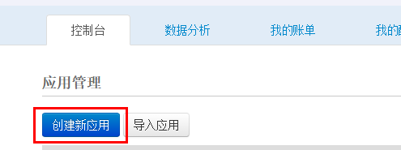
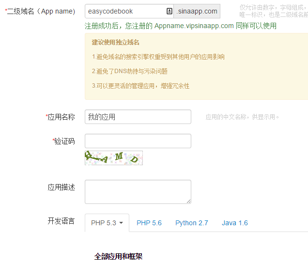
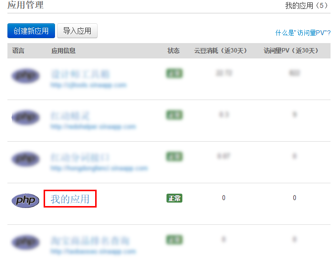
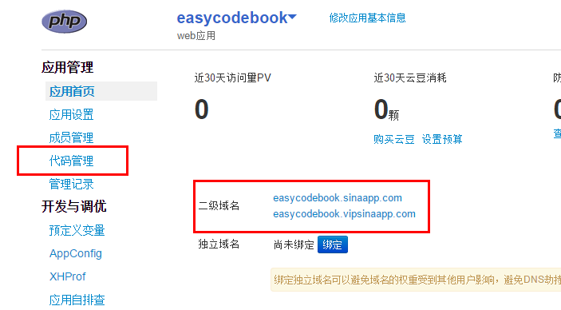
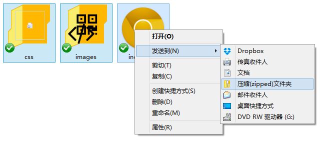
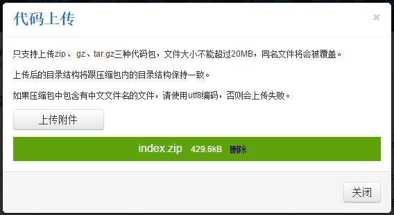
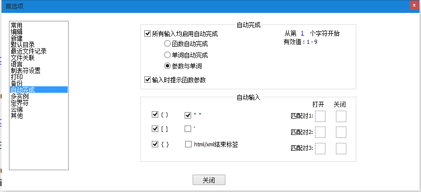
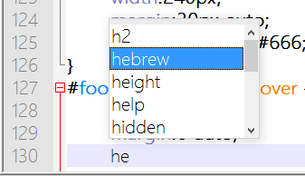

第二十五章 随便聊聊
===

现在呢，我们也做完了一个网页了，如果你恰好看懂了这些，也跟着做下来了。那么你就拥有了一个网页。挺开心的事情。但是只是自己看着这个网页你总觉得无法满足自己期望炫耀的心情。那怎么办？——发到网上去！

最简单的办法好像就是新浪的 sae（http://sae.sina.com.cn/） 了，注册开通之后，创建新应用

大概如下图填一下，二级域名和应用名称其实都是随意的。

最下面没显示出来的部分是选择程序开发语言，你就选择 php 空应用就行了，然后继续。之后就返回了你的应用列表，点击你那个应用的名称进入管理面板。

注意下图的打红框里是你这个应用的网址，用来访问的哦。然后点击代码管理。

然后建立一个版本，按钮在右上方，版本号是 1 就行，创建后界面如下

然后点击右侧操做按钮，选择上传代码包（如上图）。这个代码包就是把我们的代码打包为 zip 格式，对，用你的压缩软件就行。记得把你的网页命名为 index.html

打包的时候要从 index.html 文件这一层开始打包，外面别再套着文件夹了。就像下面这样打包。

然后这个压缩包名字用个简单的英文或者数字，免得出意外。上传上去，等到上传结束，如下图

点击关闭，然后用前面记录下来的网址就可以访问了。

---

然后由此开始建一些网站的基础知识，做网站我们需要有三样东西：域名、空间、程序。

域名：上面我让你记下来的那个网址就是域名，当然也可以自己够买个新的域名，这就相当于你的家庭地址

空间：用来放网页的地方，空间会有一个 IP ，就相当于你家所在的经纬度，我们需要通过一个操作（绑定域名）来吧你的域名指向到这个 IP，才能在访问域名的时候访问到这个空间的内容。

程序：比如你写的这个网页。

也就是通过域名这个住址访问到你家里的你。然后我们一般通过一些 FTP 软件去管理空间上的程序，或者说是管理那些既存在服务器上的文件。域名和空间都可以在网上购买，当然空间也被称作虚拟主机。

网站空间的的管理面板，可以用来管理 FTP 账户，绑定域名，数据库，甚至空间中的文件。比较常用的有两种：DA（DirectAdmin），CP（cPanel），当然在国内买应该都是中文，其实你只要找自己需要的就行了，不懂得不管他。

这样我就给了你很多的关键词，如果你有这方面的需求可以去搜索相关的教程，在这里我就不详细地去讲了。

---

说说版本管理，常见的有两种 SVN 和 Git 。前面说的 SAE 用的是 SVN 来管理代码。Git 则有著名的 Github.com （一个著名的开源代码托管网站）。

版本管理的概念是这样的（通俗版），你写了一个文件，然后保存为版本 1然后你修改一下这个文件，保存为版本 2，然后依此类推，到了版本 200。这时候我们需要找到版本 23 的内容……这个案例作为设计师一定觉得心头在滴血。版本管理在这时候就可以非常方便的找出来。

然后还可以分支：就好像我要对这个图片做一些不一样的尝试，所以我先把她复制一份去实验，嗯，这就是分支但是当实验成功了你还可以合并分支……

其实版本管理对于设计也是很有用的东西，只是很少有设计师愿意去了解一下这方面。

本书就是用 git 进行版本管理，然后提交到 Github，再通过接口在 Gitbook 上排版展示出来的。

---

关于代码自动完成的一点说明：为啥不用记代码？有自动完成谁还记他，见到认识就很好了。

Notepad++ 默认是开启的，如果没有可以到 设置——首选项——自动完成 中开启一下

开启之后，只要已经选定代码的语言（菜单栏，语言），当然保存为对应的后缀也算选定了语言，那么写代码的时候就会有提示

就像上图，我写 he 的时候就已经有 height 的提示了。然后上下键选择到你需要的项目，Tab 或者回车键都可以。这样写代码的效率是很高的。

---

学到这里是不是觉得开始有点简单了？当然就算你看得迷迷糊糊，只要你看了，那么再看后面的内容你会觉得越来越清晰，慢慢的就都明白了。
