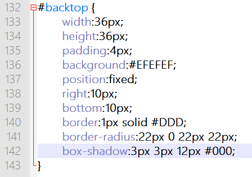

第二十七章 一些细节
===

细节自然在 css 里面修改了，先加一个淡淡的边框。

	border:1px solid #DDD;

这点装饰当然不足以让我们满足，所以我们还要给他加个圆角效果。

	border-radius:5px;

效果如下图：

border-radius 的属性值是圆角的半径。所以这么说的话……我们的图片宽度 36px，再加上两边的内补，每边 4px ，也就是·总宽度 44px，同理高度也是 44px。那么要是我让他一边的圆角半径为 22px 会是什么结果？来试试看。

	border-radius:22px;

效果如下图：

这就是个圆，好神奇是不是？原来就是这么好玩。其实还可以更好玩一点的，border-radius 支持分别设置四个角的圆角大小，我们换个写法。

	border-radius:22px 0 22px 22px;

再看看效果：

颤抖吧，射击师，以后这种小标签我就不找你们去制作了，怪麻烦的。

然后我们试着再给他加一些阴影，阴影的写法也很简单

	box-shadow:横坐标偏移 纵坐标便宜 扩散大小 颜色;

写上数值就是：

	box-shadow:3px 3px 12px #000;

效果如下：

你可以改动各个数值看看效果，慢慢就知道怎么去运用它了。当然今天讲的这两个效果你在 IE 8 及其以下版本中可能看不到或者效果很差，换浏览器吧兄弟~

然后现在再看看这个小小的图片上我们定义的 css 

为什么我想起了做设计的时候一个图层上同时添加的 N 个图层样式？

来吧，试试看你有什么样的奇思妙想，能做出多么帅气的按钮来？

