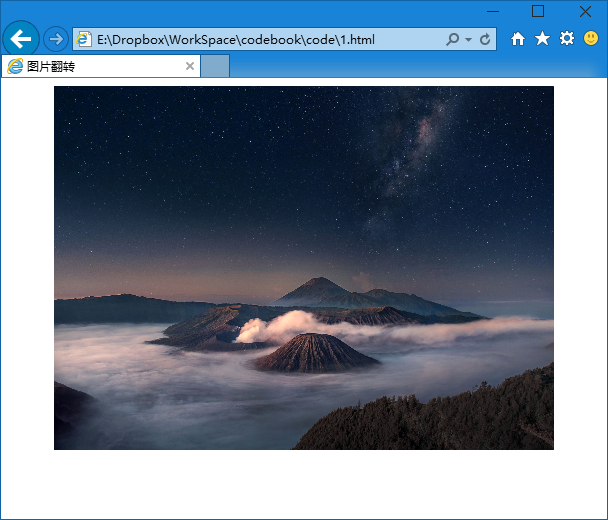
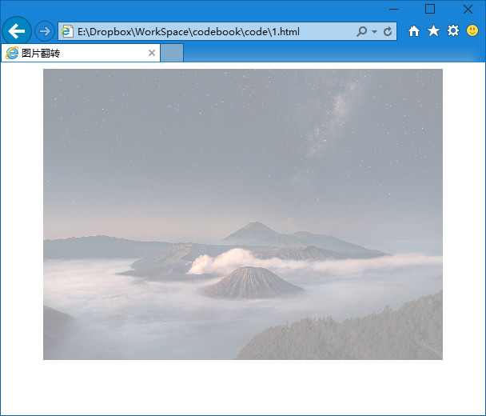
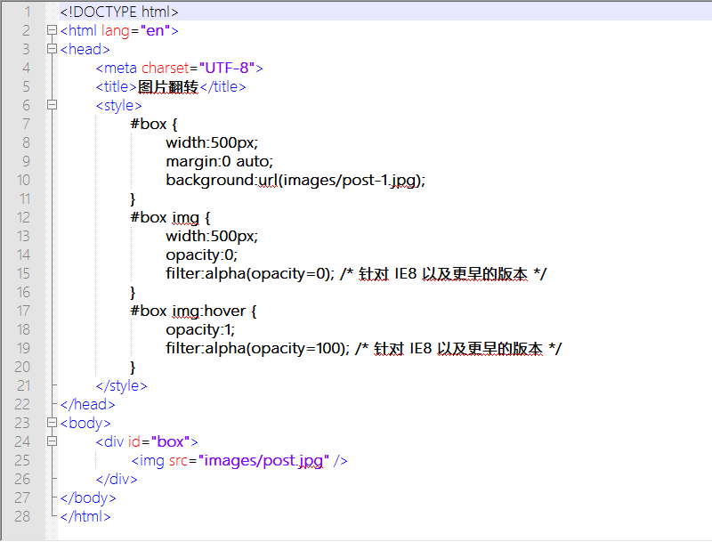

第二十八章 图片翻转（一）
===

图片翻转这种效果是经常被提到的，那么怎么去做呢？我们试试看。

**第一种：透明度**

这个办法很简单，我们举个例子

	

		
	

css 如下：

	#box {
		width:500px;
		margin:0 auto;
	}
	#box img {
		width:500px;
	}

这时的效果大家都能看出来，因为就是插入了一张图片，设置了一下大小而已。

这时候我们给它加上效果，来一个新的属性，透明度

	#box img {
		width:500px;
		opacity:0.4;
		filter:alpha(opacity=40); /* 针对 IE8 以及更早的版本 */
	}

嗯，我增加了两个属性，opacity 就是 css 的透明度。，下边那一行，嗯，是变态的 IE 用的滤镜，为了让 IE8 及其以前版本可以显示透明效果所以增加这么一行，这就是传说中的解决兼容性问题。

来看看效果，

图片变淡了。其实是透明了，但是现在下面没有东东，所以看起来就是变淡了。然后我们说说上面两个属性，opacity 的 值为从 0 到 1 的值，0 是完全透明，1 是完全不透明。然后 filter:alpha(opacity=40) 中 40 的位置可以用从 0 到100 的值。0 是完全透明，100 是完全不透明。

然后我们加动态效果。

	#box img:hover {
		opacity:1;
		filter:alpha(opacity=100); /* 针对 IE8 以及更早的版本 */
	}

这个什么意思呢？就是鼠标划到图片上的时候图片变为完全不透明，大家可以试试效果，我就不截图了。

上面已经做出了一个常用的效果，但是我并不满足啊，我多贪心~粉丝可以再多些咩？我要做两个图片的切换，吼吼。

那么我要是给 #box 设置上背景，然后把 #box img 的透明度设置为 0 的话显示出来的就是 #box 的背景；然后鼠标滑过时，再让 #box img 完全显示，遮住后面的背景。来我们试试看哦，依旧是修改 css

	#box {
		width:500px;
		margin:0 auto;
		background:url(images/post-1.jpg);
	}
	#box img {
		width:500px;
		opacity:0;
		filter:alpha(opacity=0); /* 针对 IE8 以及更早的版本 */
	}
	#box img:hover {
		opacity:1;
		filter:alpha(opacity=100); /* 针对 IE8 以及更早的版本 */
	}

看到了，其实变化很少的，来看一下整体代码。下一章我们来介绍使用其他方法来实现这个功能。

