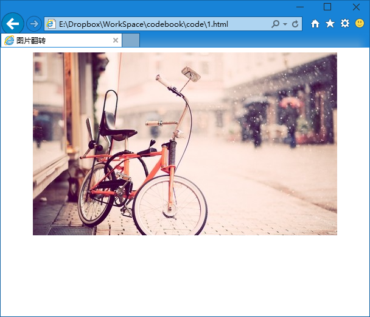
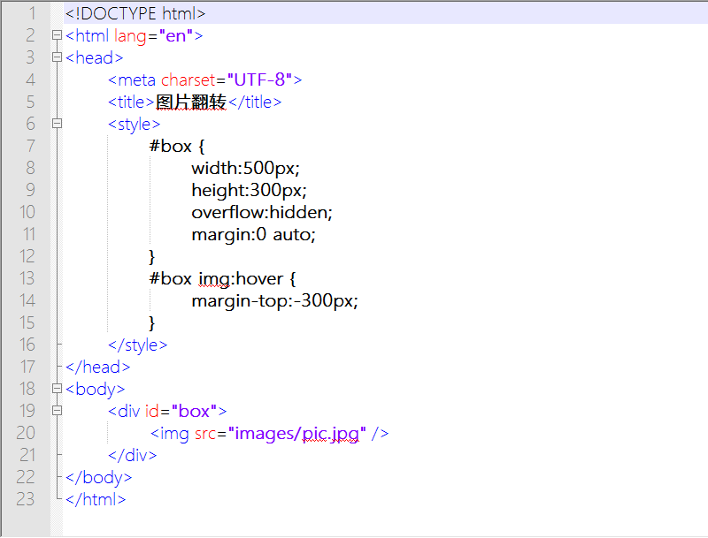

第二十九章 图片翻转（二）
===

今天我们换个玩吧，先去准备一张图片，什么样的图片呢？比如我要显示一个 500×300 的图片，然后鼠标划过时显示为另一张 500×300 的图片。那么我们现在要做的就是把这两张图片连成一张.这很简单，比如我连成了这样

当然你横着连接也完全没有问题。只是代码有点区别而已。然后我们写出来我们的网页结构，其实跟前一章没啥区别。

	

		
	

跟上一章的区别……就是我换了张图片……真正的区别在 css。这你就看出来了，html 是骨架，css 是肉，骨架一样，也有千百万种变化，胖瘦美丑，因人而异。

	#box {
		width:500px;
		height:300px;
		overflow:hidden;
		margin:0 auto;
	}

我给了 #box 确定的宽高。然后告诉他，如果你里面的东西超出了这个范围怎么办呢？那就把超出的部分隐藏不显示。

现在我们知道啊，我没的图片就比这个范围大，结果会显示成什么样呢？

他只显示了他范围内的内容，超出的部分没有显示。大家可以用“审核元素”的方式看看各个元素的位置和大小，以加深理解。最好也修改数值看看效果，增加认识。当然你不做我也没办法，当时你不会的时候老板一定拿你有办法。

然后我们再加上动作，当鼠标划到图片上的显示下边的图片。其实就是当鼠标划到图片上的时候，把下边的图片移动到可以被显示出来的位置。

	#box img:hover {
		margin-top:-300px;
	}

margin 是往上面裹泡沫，但是如果是负数呢？那就是往下剥了吧？从顶层剥落三百像素的结果就是把下边的图片显示出来了。好乱？其实很简单的事，我们就是在白纸上挖个窟窿，然后拿个卡片在底下推来推去的，窟窿里能看到的画面因此发生变化而已。多用“审核元素”看看发生了什么，看看大家都在哪里。也试着改变数值看看变化，这是很好很好的学习方法。

