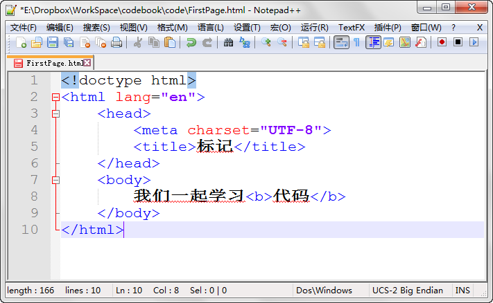

第三章 标记语言
===

其实前边的都是废话。Html 是啥？它的全称是“超文本标记语言”。再超还是文本而已，唯一比文本特殊的就是标记！

什么是标记？又怎么去标记？搞懂这这两个概念你基本就可以直接去阅读 Html 代码了。

	<标记>被标记的内容</标记>

这是一个很基础的标记格式，比如呢，粗体可以用 b 进行标记，于是如下文字（代码）

	我们一起学习<b>代码</b>

在网页中显示效果如下：

当您理解标记之后，再回头看我们上一课的代码就会觉清晰明了起来。

这次是不是感觉看懂了一些呢？但是我的天啊，平时写代码的时候可没人给我左边用这么浓墨重彩（俗的掉渣）的线条来给我画出来网页结构，让我一目了然。这可怎么办啊？

这时候我们就要学到第二个小知识了：代码缩进。通过添加 Tab 空白似的代码前边留出相应的空白来表现代码的层级。你看我把代码稍微修改一下哦~

这么看来，前端没有空白的行是第一层，前端有一个 Tab 空白（在我这里相当于四个空格的宽度，这个可以设置），则是第二层，两个 Tab 空白的是第三层。这样是不是就很容易查找了呢？

虽然我们是新手，但是代码缩进的习惯必须要养成，否则，自己看自己写的代码都吃力啊。