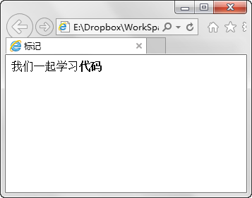
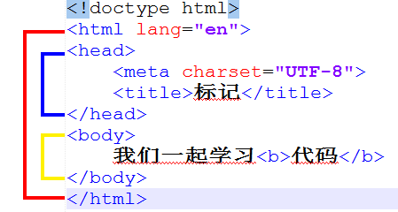

第三章 标记语言
===

其实前边的都是废话。Html 是啥？它的全称是“超文本标记语言”。再超还是文本而已，唯一比文本特殊的就是标记！

什么是标记？又怎么去标记？搞懂这这两个概念你基本就可以直接去阅读 Html 代码了。

	<标记>被标记的内容</标记>

这是一个很基础的标记格式，比如呢，粗体可以用 b 进行标记，于是如下文字（代码）

	我们一起学习<b>代码</b>

在网页中显示效果如下：

当您理解标记之后，再回头看我们上一课的代码就会觉清晰明了起来。

