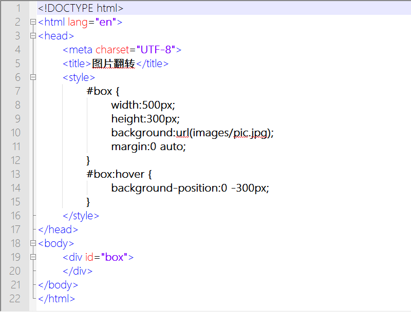

第三十章 图片翻转（三）
===

移动图片，然后让他显示相应的位置。忽然想起前面我们作业面大海报的时候好像用过类似方法。来试试看

	

	

这个结构更加简单了，那么 css 怎么写？

	#box {
		width:500px;
		height:300px;
		background:url(images/pic.jpg);
		margin:0 auto;
	}

咱们怎么省事怎么算哦，背景总是只能显示在元素之内，超出的部分自然就不显示。

然后呢，鼠标滑过来了，快变身呀！

	#box:hover {
		background-position:0 -300px;
	}

这是啥意思来着？背景图片的位置以前是 0 0 （默认），现在纵坐标发生了变化，变化为 -300px 。关于这个坐标系可参见第二十章。其实自己试试也就知道了。那么来试试效果，成功了吧，好像这次代码更简单一些了呢。大家思考一下我们要怎么为这个元素加链接呢？

