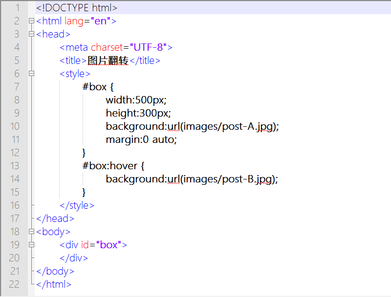

第三十一章 图片翻转（四）
===

其实，我们想，我们也许还可以更简单更好理解一些。我们为什么要把图片连接接在一起呢？我就两个图片不好么？起码我作图可以省一点事。嗯，我很懒，确实很懒。

那么我们试试看哦，我现在有两张图片，给同一个元素的话……我先把元素写出来。

	

	

设置元素的样式，先给她第一张图片做背景。

	#box {
		width:500px;
		height:300px;
		background:url(images/post-A.jpg);
		margin:0 auto;
	}

然后当鼠标滑过换成另一张背景

	#box:hover {
		background:url(images/post-B.jpg);
	}

然后我们试了一下，嘿，这也行。

现在再想一想，我为什么要说神一样的 css 呢？如果还不知道就把这些例子的 css 去掉再看看。