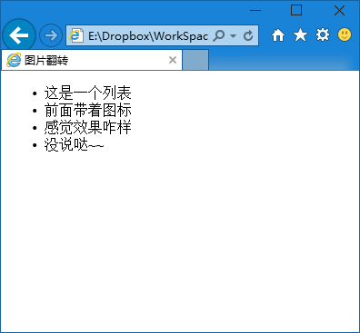
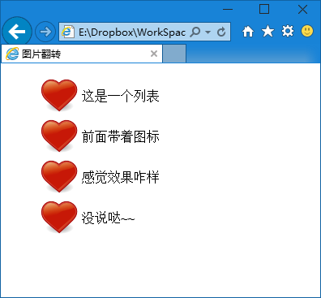
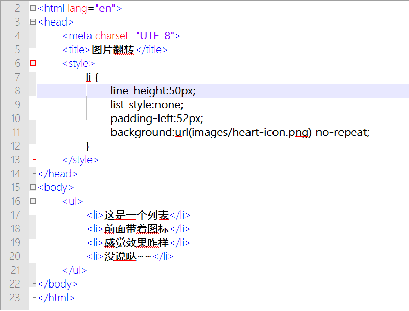

第三十二章  一个图标
===

这个玩法适用于很多情况，我们举两个例子。首先我们准备一个图标了，

这个图表标大小为 48×48 大小，我们来写网页结构

	<ul>
		<li>这是一个列表</li>
		<li>前面带着图标</li>
		<li>感觉效果咋样</li>
		<li>没说哒~~</li>
	</ul>

然后写 css ，嗯，挺简单的

	li {
		line-height:50px;
		list-style:none;
		padding-left:52px;
		background:url(images/heart-icon.png) no-repeat;
	}

不加 css 的效果是这样子的。

加上 css 的效果是

我们解释一下 css 哦。行高 50 是根据图标高度制定的，当然实际制作的时候应该根据你需要什么样的行高来做多大的图标（但是作者太懒了，随便找个图标来糊弄，大家不要学他）。list-style 设置为无，让列表项前面的原点消失。然后 padding-left 让每个列表项的左侧留出适当的空白。为什么是 padding 而不是 margin 呢？背景图像会显示在内补的范围内，因为这是元素内部，而不会显示在外补范围内，因为这是元素的外部。

最后一行设置背景为我们的图标，但是比我们以前学习的 设置背景多了个 no-repeat ，这个意思是不重复（也可以叫做不平铺），那么这个图只显示一次了。背景默认是从左上角与元素对其的，而元素左侧正好留出了相应的空白，于是图标显示在预留的空白中，看起来的效果就是给每行前加了一个小图标。

没看懂？一个一个的添加上述 CSS 属性查看效果，然后思考一下。然后问一下，现在的图标有点偏上，为什么？怎么解决？

