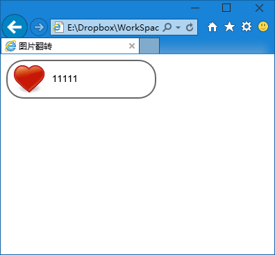
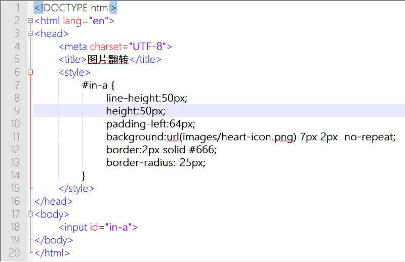
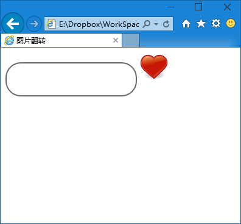
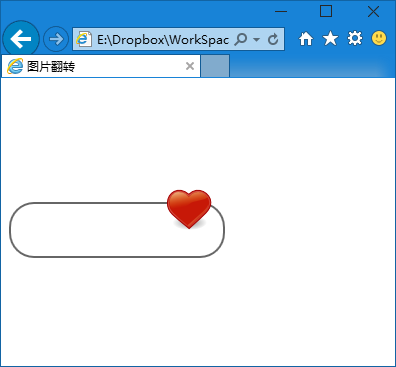
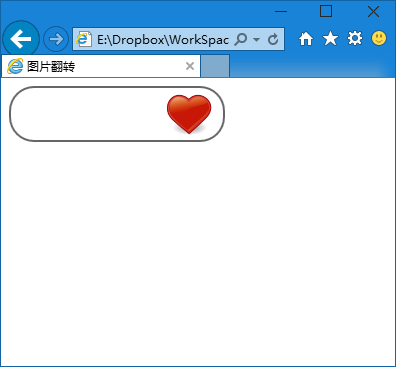

第三十三章  两个图标
===

别以为我上一节忘记了，第二个例子在这里呢，只是这次做的比上一次略显复杂。我们来做两个输入框。

第一个搜索框很简单，基本跟上一章一样一样的，我们来看看代码

	<input id="in-a">

然后 css 代码如下

	#in-a {
		line-height:50px;
		height:50px;
		padding-left:64px;
		background:url(images/heart-icon.png) 7px 2px  no-repeat;
		border:2px solid #666;
		border-radius: 25px;
	}

大家看看有哪些变化，为什么？在输入框里输入文字试试效果。

因为这个变化不大，不多讲解，不过我想这种输入框大家一定见得不少

现在我们在来做另一个，先来写页面结构

	<input id="in-b">
	<input id=“in-c” type="image" src="images/heart-icon.png" alt="Submit" />

然后我们逐步添加 css

	#in-b {
		line-height:50px;
		height:50px;
		padding-right:64px;
		border:2px solid #666;
		border-radius: 25px;
	}

这时候效果如下

然后在上面基础上添加一个 margin-right:-64px; 试试看。结果效果如下

现在的问题是按钮比输入框偏上，所以给他加一个 margin-top

	#in-c {
		margin-top:10px;
	}

然后我们发现几乎没有变化，我用审核元素也没看出什么奇怪的的问题，但是就是不对齐啊。所以我使用极限法测试，直接把上面的 10px 改成了 100px，结果……

谁陪我一起去墙角哭一会去？这都那跟哪啊？写教程的表示也被震惊迷糊了（平时随便找个什么东西绑定上事件就当按钮用了，好容易老老实实写一次，还给我整这幺蛾子。）

然后一查，这种 input 啊按钮啊的不对齐需要加一个属性 vertical-align:middle; 意思就是竖直方向中心线对齐，反正给两个元素都加上就可以了，再试试看（记得把 #in-c 的 margin-top 改成 2px ，咱不能一直走极端）。

这次就达到预期效果了，按钮显示在输入框之内。大家可以研究着完善这几种方式，为了减少干扰好多细节的处理我都没有写，大家把他们做完美吧。