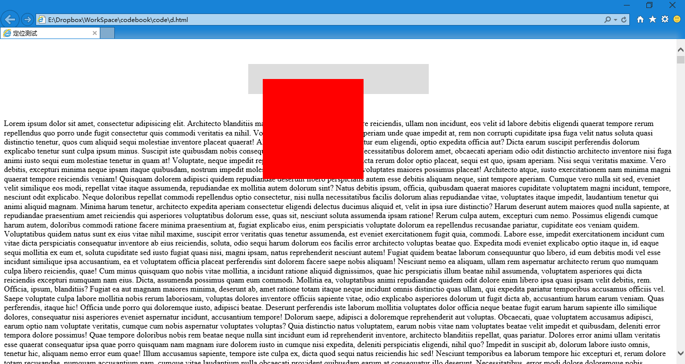

第三十五章 定位（一）
===

关于元素的定位是一个深刻的话题。因为在我们进行排版的时候如果能够想把元素放在哪里就放在哪里那将是一件很美妙的事情。毕竟在做之前章节的练习的时候我们最犯愁的就是这个问题了。但我还是要说：**如果你没有把前面的章节学会还是不要看后面的章节比较好**。

强大和简便常常意味着隐含巨大的麻烦。今天讲的这些定位方法总会让很多新手感觉是如此便捷，但是这东西你要是用多了你的页面……我是无法猜测有多么奇葩了。

其实前边我们讲了一个定位方法 position: fixed; 这是相对于浏览器定位。当然还有一个默认的定位方法 position: static; 这个方法是默认的，所以我们一般不会写出，他的意思是：没有定位，元素出现在正常的流中。

那么我们开始做实验了哦。我们来写页面，当然那些应该先写上的页面基础结构我就在这里写出了，但是你们要写啊，我不屑只是省略重复的部分，来缩短篇幅，你们也不写是为了出错么？我看到有的同学居然也只写 body 部分内容，然后问我为什么 css 不起作用……

	

		

	

	这里写上大量文字用来看效果，我直接生成了五万随机文字，就不复制过来了，咳咳，否则看晕你们

然后我们写点 css，来定义一些初始的样式。

	#outbox {
		width:300px;
		background: #DDD;
		margin: 50px auto;
		padding: 30px;
	}
	#inbox {
		width:200px;
		height: 200px;
		background: red;
	}

这个都看得懂哈，现在的预览效果应该是

然后我们先试试 fixed，给 #inbox 添上 position: fixed; 属性看看。结果是这个样子的。

而且滚动的时候，红色的 #inbox 一直不动（相对于浏览器窗口不动）。然后灰色的 #outbox 变矮了。其实 #outbox 现在的高度只是他的内补在撑着，换言之，即便没有 #inbox  ，#outbox 的显示效果也是跟现在一样的。所以我们说：**position: fixed; 之后的 #inbox 已经不在文档流之中了**，仔细想想这句话什么意思。反正呢，现在文档中其他元素的定位对于他不会产生影响，反之它的定位也不会对其他元素产生影响。跳出三界外，不在五行中。纷纷扰扰与我无关……

那么为了加强理解，我再打个比方：浏览器是个箱子，我们在里面摆放各种大大小小的盒子。这是正常的流。当然了，盒子里可能还会摆放着几个更小的盒子，这是 div 的嵌套。现在我在浏览器这个大箱子上面放了一块玻璃板，然后上面放了一个盒子，那么玻璃板上的盒子和箱子里的盒子互不干扰，那么玻璃板上的盒子就是 fixed 定位元素。

fixed 元素可已使用 left、right、top、bottom 属性来设置他的位置。