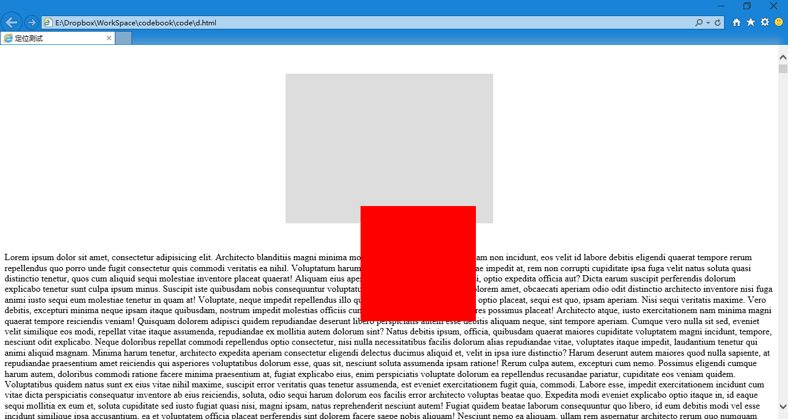

第三十六章 定位（二）
===

如果只是相对于浏览器定位未免太过局限，那么我们来相对于元素定位。

把上一例中的 position: fixed; 改为 position: relative;,然后加上 left 和 top 属性。，现在 css 变为

	#outbox {
		width:300px;
		background: #DDD;
		margin: 50px auto;
		padding: 30px;
	}
	#inbox {
		width:200px;
		height: 200px;
		background: red;
		position: relative;
		left:100px;
		top: 200px;
	}

来看效果

发生了什么呢？#inbox 相对于他原来的位置偏移了 left:100px; top: 200px;，注意理解这一句，在他原来该在的位置上偏移。那么他现在的位置跟他本来该在的位置是相关的。

然后注意 #outbox 的大小没有变化，说明里边还有东西撑着。那是因为 #inbox 虽然偏移走了，但是他还占着原来的位置。

这个还是来打个比方说明，这次定位跟浏览器这个大箱子没关系了。我们看箱子里的小盒子，大盒子里放着小盒子。现在我把小盒子拿出来换做一个跟小盒子一样大的泡沫塑料块把这个位置占上。然后用一根铁丝（你看不见铁丝，看不见）一头插在这块泡沫上，另一头插在我们刚才拿出来的小盒子上。现在调整铁丝的姿态就可以调整小盒子的位置，而我们移动大盒子或者移动占位置的泡沫块的时候小盒子一定会跟着发生相应的位置变化。记得铁丝插入泡沫塑料块的时候泡沫塑料块会疼的叫唤：“R~~~~”，所以这个定位方法是 position: relative;

讲到这里你可要动手实验啊，要不怎么可能看的懂呢，还有我的比方要认真读懂，不行就自己找几个小盒子试一试。