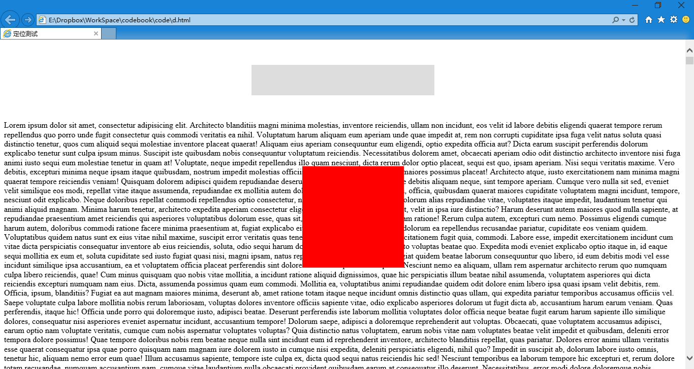

第三十七章 定位（三）
===

然后我们继续发生着改变，把 position: relative; 定位给 #outbox，但是不给他 left 等具体的位置信息，那么 #outbox 应该在哪里？对爱是在他原来的位置，就像生么都没发生一样，虽然其实内心已经变得那么的不安分了呢。

而里面的 #inbox 的定位改做 position: absolute; ，其他不变话，然后 css 变成了

	#outbox {
		width:300px;
		background: #DDD;
		margin: 50px auto;
		padding: 30px;
		position: relative;
	}
	#inbox {
		width:200px;
		height: 200px;
		background: red;
		position: absolute;
		left:100px;
		top: 200px;
	}

来看效果，

这个定位略微复杂，我们要先把他说清楚才能告诉你发生了什么。我们知道了 fixed 定位是相对于浏览器定位；relative 定位是相对于元素原来的位置定位；那么 absolute 呢？他是相对于套在他外面第一个不是 static 定位的元素来进行定位。

那么 #inbox 外面套的 #outbox 便是**第一个不是 static 定位的元素**，所以现在 #inbox 相对于 #outbox 的左上角进行定位，#outbox 的 padding 对这个定位不产生影响。然后我们在页面中看到 #outbox 又扁了，说明 #inbox 又在文档流中消失了。如果元素在文档流里消失了就是绝对定位，绝对滚蛋了，不用给他留位置了。相对定位人走了位置还留着停薪留职。

然后我们打比方：有一个小盒子拿到了一份调令是 absolute ，于是他就一层一层往外找，找那个管着他的（套在他外面的，没套在他外面的管不着他），而且与此事相关的（定位是 static 都边上打酱油去，他们管不着这个事）的大领导（大盒子）。然后在大领导指定的方向上调离（在大盒子左上角插一根铁丝<铁丝不占位置，你看不见看不见>把自己挑到指定位置）

你可要仔细研究我的比方啊，这个模型理解了基本就理解这几种定位方式了啊。