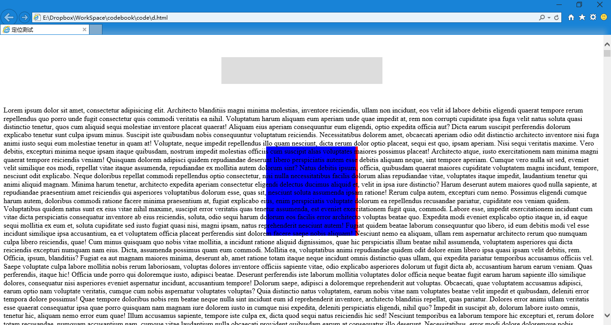

第三十八章 定位（四）
===

后来盒子世界出事了，原因是某个小白把两个元素给定位到了同一个位置，这俩盒子（元素）搞不清谁在上边谁在下边了，这个是一个很严重的问题，直接影响到自己是否出镜。小白也很头疼。然后想了想，反正都是用铁丝挑着挂在了指定的位置，那我把想显示的东西跳得高点不就行了，有了高低顺序就不冲突了。就好像 PS 里两个元素位置相同，但是不在同一个图层，谁遮住谁的为题就很简单了。

于是我们迎来了一个新的属性 z-index ，很好理解，就是 z 轴的排序。我们再来重复一下浏览器的坐标系哦。

X 轴：左右方向，右为正方向；
Y 轴：上下方向，下为正方向；
Z 轴：里外方向，外为正方向；

这个里外方向就是你的显示器往里往外的方向（Z 轴垂直于浏览器）。

那么举个例子，比如如下页面结构：

	

		

		

	

然后 css 如下：

	#outbox {
		width:300px;
		background: #DDD;
		margin: 50px auto;
		padding: 30px;
		position: relative;
	}
	#inbox {
		width:200px;
		height: 200px;
		background: red;
		position: absolute;
		left:105px;
		top: 200px;
		z-index:9;
	}
	#inbox-top {
		width:200px;
		height: 200px;
		background: blue;
		position: absolute;
		left:100px;
		top: 200px;
		z-index:6;
	}

然后调整两个 z-index 的值来看看效果，再调成负数看看效果。比如我调成负数之后的效果。

然后下节课我们来学习你们期待已久的网页自适应（响应式）。