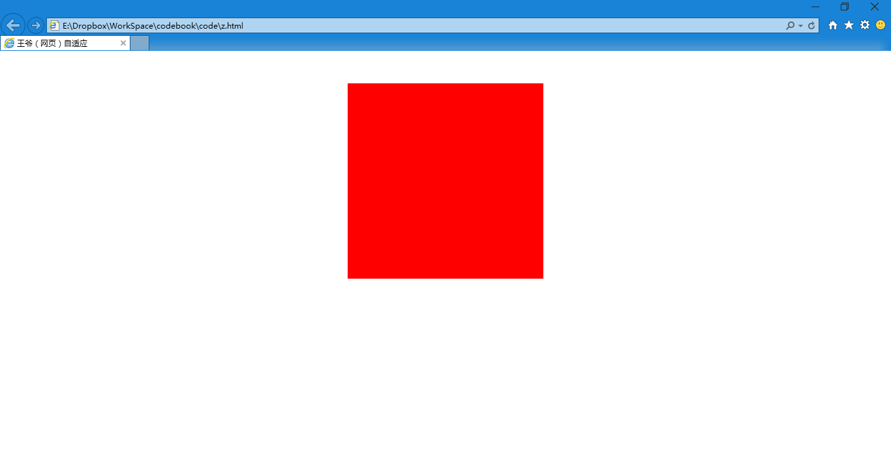
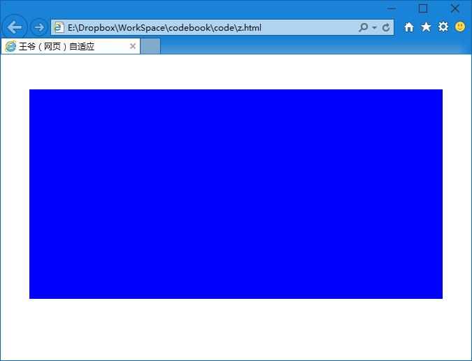

第三十九章 网页自适应（一）
===

从教程开始就有人一直追着我问这个网页自适应怎么做。其实这个功能现在做起来很简单，但是你要是前边的基础掌握的不好那就剩下迷糊了。

简单的说就是一个媒体查询的事情，但是……做起来常常要写两遍 css （如果变化比较大的话），甚至很多遍（适应多种屏幕）……

我们先来讲个简单的例子看看。有多么简单呢？页面结构如下：

	

然后 css 如下：

	#change-color {
		width:300px;
		height:300px;
		margin:50px auto;
		background:red;
	}

这个很简单，大家都能想象出来是一个多么枯燥的页面，一个 300 × 300 像素的红色正方形在页面的中上部。学到这里的同学对于这样简单的代码应该是无压力的了。

然后我们在这段 css 后面再加上一点内容，改做：

	#change-color {
		width:300px;
		height:300px;
		margin:50px auto;
		background:red;
	}
	@media (max-width:800px){
		#change-color {
			width:90%;
			height:300px;
			margin:50px auto;
			background:blue;
		}
	}

来一起看看这个 css 哦，这段 css 可以分作两个部分，第一部分就是我们上面写的对 #change-color  定义的 css ，这个无需解释了。第二部分跟我们以前看到的不一样哈，但是如果去掉 @media (max-width:800px){……} 这样的结构之后，我们可以发现，剩下的内容也是对 #change-color 的定义，只是跟上面略有不同，一个是宽度发生了变化，一个是背景色改了。那么现在我们来解释一下这部分代码。

默认情况执行第一部分的定义，那么背景色就应该是红色的，宽度是 300px。一切如同我们与想的一样。

当**浏览器内容部分的宽度小于等于 800px（符合条件，最大宽度为 800px）时**，使用第二部分的定义，也就是宽度变成了 90%，背景色变成了蓝色。

然后我们看看实际效果：当网页宽度大于 800px

然后调整窗口宽度到内容区域小于 800px

现在效果实现了，那么在来解释一下关键的语法——

	@media (条件){条件达成时执行的 css 样式} 

条件可以设置很多种，比如：max-width、min-width、max-height、min-height …… max 是最大，min 是最小，就是当宽度（高度）最大（最小）是什么什么时去执行大括号里的东东。注意：这里指的不是一个单纯的值，而是一个范围，他给出的是一个上限（或者下限）。

甚至我们还可以联合几个条件一起使用，比如：

	@media (min-width:300px) and (max-width:800px){条件达成时执行的 css 样式} 

这就是当浏览器的内容范围宽度在 300px 到 800px 执行这部分 css 语句。

现在留一个问题给大家思考：前面举例的 css 代码可以被看作两个部分，那么我把两个部分的顺序调调换行不行？为什么？