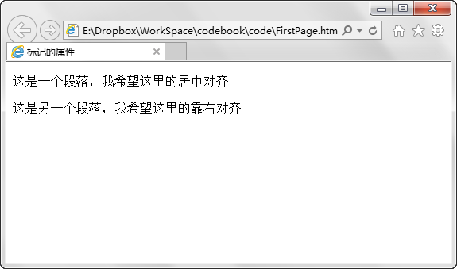
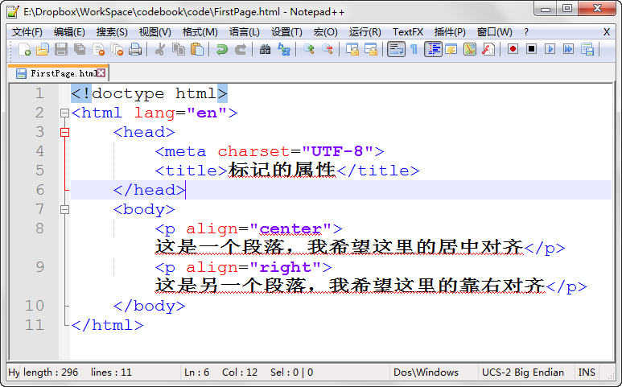
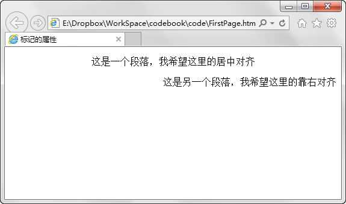

第四章 标记的属性
===

但是有的时候单单是简单的进行标记并不能达到我们的目的，这时候我们需要对标记设置属性。来看下面的例子：

首先说明，

	
这是段落标记，标记中的内容算作一个段落来展示

虽然我在汉字里认真的写下了我的希望，但是当然的，死板的电脑并不会理解我的希望，只是死板的显示依旧左对齐的文字，完全不理会我虔诚的心……

这时候我要给每个段落的标记加上对齐的属性。

看到我修改了什么吧，我把关键部分的代码贴出来我们仔细看一下。

	
这是一个段落，我希望这里的居中对齐

	
这是另一个段落，我希望这里的靠右对齐

我们在 <p\> 这个段落标记里加上了 align 属性，当 align 属性的值为 center 时（第一段），则居中对齐，如果属性值为 right （第二段），则靠右对齐。如果不写这个属性则默认左对齐（符合我们日常习惯），来看下效果。

我们再回味一下哈，当然为了照顾部分像我一样英语渣渣的不行的同学，我贴几个单词解释。

> Paragraph    段落
> 
> Align    对齐
> 
> Center    中间
> 
> Right    右边

再看上边代码，不说了，就是用特定的格式拿英语说说要求嘛。