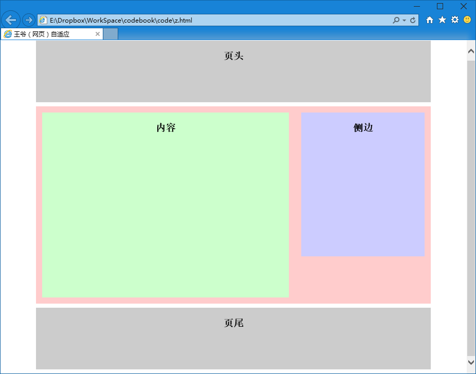
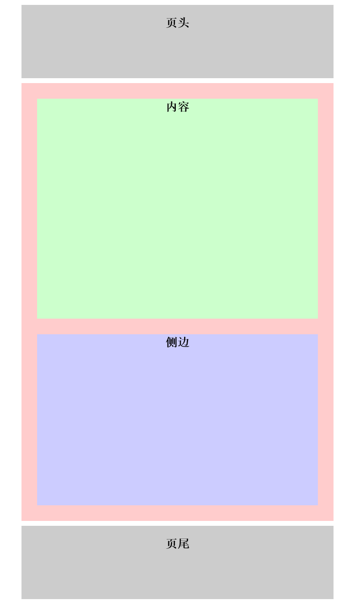

第四十章 网页自适应（二）
===

前一章学的有点晕？那很正常，我们来一起做个小练习看看。我们就做一个很简单的自适应页面好了。这个页面十分简单，就是页头、页尾、内容、侧边四部分，很古典的布局（土得掉渣）。来开始写结构

	

	

		

		

	

	

然后为了我们方便辨认，我再给每个里面加个标题写明他们是什么，然后就变成了这样：

	
<h2>页头</h2>

	

		
<h2>内容</h2>

		
<h2>侧边</h2>

	

	
<h2>页尾</h2>

又是如此简单的 html ，剩下的工作还是扔给辛苦的 css 去了。

	h2 {
		text-align:center;
		line-height:36px;
	}
	#header, #footer {
		width:960px;
		height:150px;
		margin:10px auto;
		background:#CCC;
		overflow: hidden;
	}
	#main {
		width:960px;
		margin:10px auto;
		background:#FCC;
		padding:15px;
		overflow: hidden;
	}
	#content, #sider {
		float:left;
		margin:15px
	}
	#content {
		width:600px;
		height:450px;
		background:#CFC;
	}
	#sider {
		width:300px;
		height:350px;
		background:#CCF;
	}

然后就写出了如下这个奇葩的页面：

这诡异的配色……到底还是清晰的显示出了每一个区域的位置，各位将就看下吧。

然后我们在 css 后面继续添加内容，当然我们需要思考一下，当前的布局适应的是电脑，大屏幕哦，要是屏幕小于 960px 就肯定要出现横向滚动条，比如……手机

那么我们来适应一下我们假象中的小屏幕吧。

	@media (max-width:1024px){
		#header, #footer {
			width:90%;
		}
		#main {
			width:90%;
		}
		#content, #sider {
			float:none;
			margin:5%;
			width:90%;
		}
	}

大家看到我为小于 1024px 的屏幕写的 css 并不多，是因为没写到的部分可以继承前面的默认定义，现在元素的宽都改作了百分比的形式。这时候你打开网页……嗯，还是以前的样子哈，但是让你调整窗口的宽度逐渐变小，就会看到网页变成下图的样子，这就是网页自适应了。

