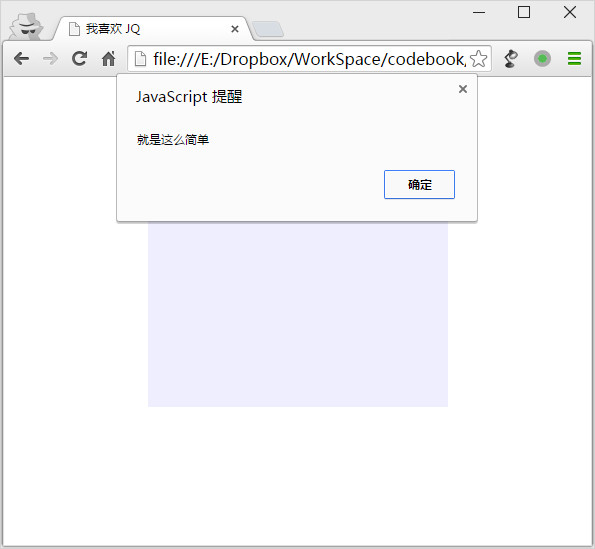

第四十二章 再说说 JQ
===

JQuery 是个好玩的东西，它是一个 JavaScript 库。，你说库是什么东东？我打个比方啊：JS 是工具，比如锤子啊，扳手啊，我们可以用他们制造出我们想要的东西来，这是一个生产的工程。我们写JS，就相当于用这些工具生产我们想要的网页效果。但是呢 JQ 机器，用 JS 这些工具制造出来机器，我们只需要开动机器，就可以又快又好的生产我们需要的效果。这么说来，你是想要用锤子生产，还是用机器生产呢？

当然我们要明确一点，机器再好也不可能完全替代锤子扳手，因为机器终究只能生产一些预定好的东西。不过好在我们日常的小需求 JQ 这台机器基本都能满足了，所以我们先学习开机器，让生产进行起来。

既然 JQuery 就是 JS 搞出来的工具，那么其实他跟 JS 是兼容的，你只需要像用 JS 一样用 JQ 就差不多。我们来玩个简单的哦。

	<!DOCTYPE html>
	<html lang="en">
	<head>
		<meta charset="UTF-8">
		<title>我喜欢 JQ</title>
		
		
		
	</head>
	<body>
		

	</body>
	</html>

现在我们来讲解这段代码，第一个 script 标签是引入 JQuery ，是的，你要用机器就要把机器搬过来，你要请人帮忙，就要先把人叫过来。你没搬机器，没请人来，后面你想做的工作肯定没法完成，对不？这是必须的准备工作，JQuery 你可以去官方下载（ https://jquery.com/ ），然后放在合适的位置进行引用，我比较偷懒，直接使用的网上的一个网址。当然在这里大家也看出来了，JQuery 文件也就是个 js 文件。

搬来了机器，请来了工人要开始分配工作了，这就是第二个 script 标签里的内容，那么大家应该理解一个先后顺序了，先搬机器，再分配工作，也就是先引入 JQuery ，然后才能工作。

第二个 script 标签里，我们要认识的第一个结构（语句）是：

	$(document).ready(function(){
		代码
	});

首先说这段代码什么意思呢？他就是说当文档（document）准备好（ready）之后运行函数（function）中的代码。让 JQ 在文档准备好（载入完成，或者说打开完成）之后在执行可以避免很多奇奇怪怪的问题哦，所以这也是一般写 JQ 必然先写上的结构。

然后我们来学习一下 JQ 的基本语法啊，其实这个好简单的，郭德纲有句话怎么说来着：”会一句你就会一万句！“拿来说 JQ 真的再合适不过了。就一句基本的语法，玩转了就可以写出很多效果来了。

	$(选择器).事件(执行的代码);

就是当某元素（选择器就是用来指定这个元素的哦），发生某个事件（比如被单击）的时候执行括号里的代码。然后这句结束用英文分号（;）标注，记得哦，这一个语句结束要有分号的，有点像 css 每个属性写完了要加一个分号。

当然，这个语句的格式记住就好，然后要活学活用，因为事件可能变成属性、动作，而括号里的是参数，如下：

	$(选择器).属性(属性值);
	$(选择器).动作(动作参数);

反正变来变去都这一个格式啊，这个格式记牢了就能读懂了，也能试着去写了，剩下的事件啊，参数啊都是可以去查阅的。

回来继续看啊，还看这段代码：、

	$(document).ready(function(){
		代码
	});

我们现在可以给他拆分一下了，首先是 

	$(document).ready();

这次你就看懂了，然后是以前在 ready 后面括号里的内容：

	function(){
		代码
	}

这个 function 是个啥东东啊，这是个函数，不过在这里你先不用管那么多，记住这个格式，记得我们可以用他把好多行代码打包在一起当一个整体看就是了。嗯，就是个塑料袋，把零碎的代码装进去，拎起来就走。

好啦，明白啦，文档准备好了就执行塑料袋……啊，不，是 function 里的东东，看看有什么东东呢？

	$("#box").click(function(){
		alert("就是这么简单");
	});

这个结构跟上面的好像啊！我们试着解读一下，当 id=”box“ 的元素（选择器是 #box 嘛）被点击（click）的时候执行塑料袋（function）里的语句，咦，好像就这么就弄懂了呢~

那么执行了什么呢？

	alert("就是这么简单");

alert (); 这是 JS ，是一个非i常常用的东东，所以我们需要记一下他，他的意思就是弹出一个提示框，把括号里的内容显示到提示框上。然后我们打开这个网页哦，没啥稀奇，就一个正方形，我们老早就会写了呢。但是当你点击这个正方形的时候，出现了奇迹哦~

到这里要郑重的提醒一句哦，有问题一定要用审核元素的 Console（控制台） 标签了，看看 JS 出了什么错，点击错误可以直接定位到出错位置的。