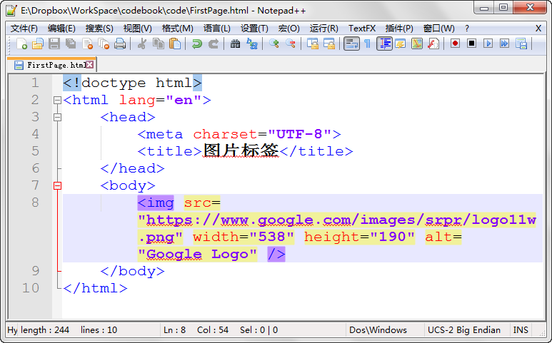
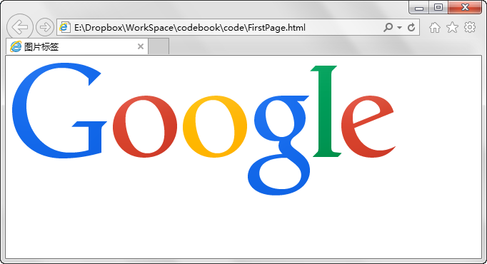
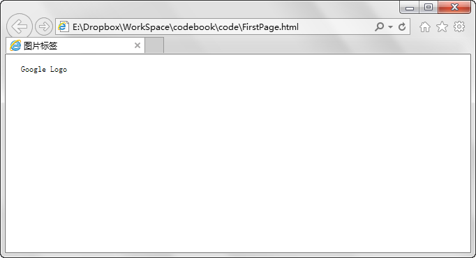

第五章 半个标签
===

本来呢标签都是两个一组的，不带斜杠的标记起始位置，带斜杠的标记结束为止。但是有些东西我们只是要标记一个位置，比如换行，我们只要说明在哪个点换行就可以了，那么出于节约的考虑就不两个一起用了，一个人能做的事情，派两个人去就剩下扯皮了。所以换行标签是：

	 

不过，更严谨的写法是把开始和结束标签放在一起，写作：

	 

嗯，这样没有结束的标签还有一个是十分常用的，就是图片标签、

	

我想大家基本一下子就看明白了，那么我们来试验一下

然后显示效果如下：

那么上面标签中几个属性大家也就不难猜出是什么意思了，只是最后的 alt 属性好像没有显示出效果来，那么现在假设我们引用的这张图片不存在的话，当然你也就无法期望在网页上正确显示出来了。可是如果空着位置，又很容易让人疑惑，但是当你设置了 alt 属性之后，图片无法显示时则会显示出如下效果：

好了，其实上面的格式是比较完整的写法，宽度啊，高度啊，你也可以不写，图片则会按照它原本的大小来显示。