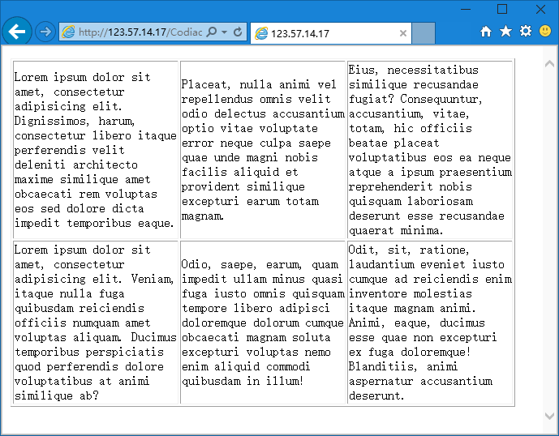

第六章 表格也不复杂
===

表格是个很常用的东西（以前），在早期的网页中，表格可不单单是用来展示数据那么简单，它是只用来做网页布局的框架使用。

表格代码：

	<table>
		<tr>
			<td></td>
			<td></td>
			<td></td>
		</tr>
		<tr>
			<td></td>
			<td></td>
			<td></td>
		</tr>
	</table>

其中，table 标签圈定表格，然后 tr 标签圈定行，td 则标记行中的单元格。所以，上述代码是一个表格中有两行，每行三个单元格（三列）。本来想展示一下效果，但是看看还是算了，上述代码什么都没显示出来……（要明白没有显示可不代表没有东西哦）

我们还是继续做点什么吧，给他们调价一些添加一些属性和内容再看看。当然，如下代码大家最好还是复制到编辑器里代码高亮了再看。

	<table border="1">
		<tr height="120">
			<td width="200">Lorem ipsum dolor sit amet, consectetur adipisicing elit. Dignissimos, harum, consectetur libero itaque perferendis velit deleniti architecto maxime similique amet obcaecati rem voluptas eos sed dolore dicta impedit temporibus eaque.</td>
			<td width="200">Placeat, nulla animi vel repellendus omnis velit odio delectus accusantium optio vitae voluptate error neque culpa saepe quae unde magni nobis facilis aliquid et provident similique excepturi earum totam magnam.</td>
			<td width="200">Eius, necessitatibus similique recusandae fugiat? Consequuntur, accusantium, vitae, totam, hic officiis beatae placeat voluptatibus eos ea neque atque a ipsum praesentium reprehenderit nobis quisquam laboriosam deserunt esse recusandae quaerat minima.</td>
		</tr>
		<tr height="120">
			<td width="200">Lorem ipsum dolor sit amet, consectetur adipisicing elit. Veniam, itaque nulla fuga quibusdam reiciendis officiis numquam amet voluptas aliquam. Ducimus temporibus perspiciatis quod perferendis dolore voluptatibus at animi similique ab?</td>
			<td width="200">Odio, saepe, earum, quam impedit ullam minus quasi fuga iusto omnis quisquam tempore libero adipisci doloremque dolorum cumque obcaecati magnam soluta excepturi voluptas nemo enim aliquid commodi quibusdam in illum!</td>
			<td width="200">Odit, sit, ratione, laudantium eveniet iusto cumque ad reiciendis enim inventore molestias itaque magnam animi. Animi, eaque, ducimus esse quae non excepturi ex fuga doloremque! Blanditiis, animi aspernatur accusantium deserunt.</td>
		</tr>
	</table>

上述代码我做了什么？

* 给表格（table）边框（border）设定了宽度（1）；
* 给行（tr）设置了高度（height）；
* 给单元格（或者说是列，td）设置了宽度（width）；
* 在每个单元格里写了一些文字，文字没有意义，就是用来展示效果。

然后他的效果是：

这样的表格跟我们对他的预期差不多了。当然不不设置表格边框宽度，或者设置为 0，那么我们则只能看到其中的内容，却看不到表格边框，这就起到了布局的作用，通过设置行和单元格的宽高来控制内容出现的位置。那么我们再举一个例子，代码如下：

	<table>
		<tr height="120">
			<td width="200"></td>
			<td width="200">我在你上面，欧也~</td>
			<td width="200"></td>
		</tr>
		<tr height="120">
			<td width="200"></td>
			<td width="200">看看我在哪里？</td>
			<td width="200"></td>
		</tr>
	</table>

这个代码应该很好理解了，我不解释，咱们看看效果。

用表格布局就是如此，当然还可以嵌套，比如在一个单元格里再放入一个表格，然后……乱到不想看。这里只是介绍一种历史中的东西，我们将来要学的是 div+css 布局，要比表格好的多。

然后如果一个有两行，第一行三列，第二行两列怎么写？像下边这样？

	<table>
		<tr>
			<td></td>
			<td></td>
			<td></td>
		</tr>
		<tr>
			<td></td>
			<td></td>
		</tr>
	</table>

那是不对滴~不过想了想我们为什么搞把事情搞那么复杂呢？以后学了 div+css 大部分事情你都不会喜欢去用表格的。真到需要的时候复杂的表格还是用 Dreamweaver 之类可视化编辑器去搞的好，反正我是不回去手写复杂的表格的。所以，嘿嘿，关于表格我们就讲到这里，想深入研究就用 DW 去试试，然后看看他生成的代码好了。