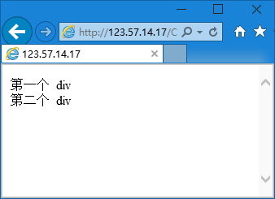

第九章 Div 和 Class、Id
===

我们经常会见到 div+css 布局的说法。那么 div 是什么？其实他就是容器，这个容器叫做盒子比较恰当，因为一般的，他表现为矩形。

事实上这东西的表现简直就是一个干净的，未曾定义（各种样式都是默认值的） Html 标签，也就是说他不会起到什么特别的效果，现在我们来看看

	

		第一个 div
	

	

		第二个 div
	

显示效果如下

结果就是这个样子的，除了换行了真的没有别的效果。其实我们需要的就是它不带任何效果的特点。干干净净的白纸才好作画。干干净净的标签才方便我们随心所欲地往上面添加各种需要的样式。

class 和 id 是几乎任何 html 标签都可以用的两个属性。其实就是给标签取名的，比如上面代码中我们一共用了两个 div ，那么我们怎么区分它们？就可以用 class 或者 id 给他们分别取一个名字，比如：

	

		第一个 div
	

	

		第二个 div
	

然后就可以很好的区分了，然后我们说一下 class 和 id 这两者的区别。其实很简单，id 不可以重复，比如有了一个 id = “A” 的元素，那么其他元素的 id 就不能是 A 了，所以 id 具有唯一性。

class 是可以重复的，比如在一个页面里有六段，前三段的 class 是 start，后三段的 class 是 end ，这样没有任何问题。你可能要问，不是用来跟别的元素区分的吗，怎么又可以重复呢？

那么我给你打个比方你就明白了，class 是什么？班级啊（初中来是这么告诉我的），你是二年级一班，我也是啊，咱俩一个班的！于是一个班的可以被赋予很多相同的东西，二年级一班的数学老师是老李，那么咱俩的数学老师都是老李。这样一喊班级“二年级一班”直接就去分出了一组人。

id 是什么？学号啊，学号能重复么？不能吧，老师叫一号回答问题，你站起来别人不会一起站起来。

那么大家就明白这两者的区别了，也应该隐约的对他们的选用有了认识。在这个基础上我们可以准备啃 CSS 这块骨头了。